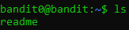
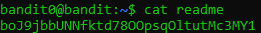
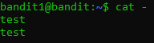
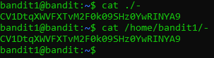
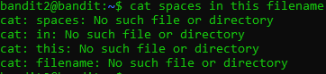
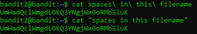
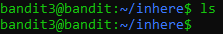
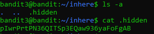
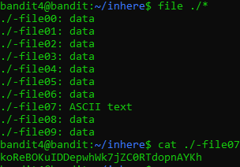

+++
title = "overthewire - bandit"
date = 2019-06-20T17:35:22.906Z
updated = 2020-12-27
aliases = ["/posts/5d0bc3da25fe1409b2e399be-overthewire-bandit"]
[taxonomies]
tags = ['overthewire']
categories = ["ctf-writeups"]
+++

# Level 0
> The password for the next level is stored in a file called `readme` located in the home directory. Use this password 
>to log into bandit1 using SSH. Whenever you find a password for a level, use SSH (on port 2220) to log into that level 
>and continue the game.


To begin, we need to ssh into the server.
```
ssh bandit0@bandit.labs.overthewire.org -p 2220
```
The password was given to be `bandit0`. After connecting to the server, we can list the files in the directory using `ls`. 

<!-- more -->



Now, we can read the contents of `readme` using `cat readme`:



The `readme` contained the password for level 1: `boJ9jbbUNNfktd78OOpsqOltutMc3MY1`.

# Level 1
> The password for the next level is stored in a file called `-` located in the home directory

Again, we ssh into the server:
```
ssh bandit1@bandit.labs.overthewire.org -p 2220
```
We can run `ls`, and we see a file named `-`. 
```
bandit1@bandit:~$ ls
-
```
If we try to do `cat -`, we would be passing in `stdin` to `cat`. This results in `cat` simply mirroring any input given to it:



To be able to access the file, we can use a relative path, such as `./-`, or an absolute path, such as `/home/bandit1/-`:



The password for the next level is `CV1DtqXWVFXTvM2F0k09SHz0YwRINYA9`.

# Level 2
> The password for the next level is stored in a file called `spaces in this filename` located in the home directory

This is a similar challenge to the last level. If we simply try `cat spaces in this filename`, it will attempt to read 4 
different files each named `spaces`, `in`, `this`, `filename`:



However, if we put the file name in quotes: `cat "spaces in this filename"` or simply use tab completion: 
`cat spaces\ in\ this\ filename`, we will have no problems in reading the file:



The password for level 3 is `UmHadQclWmgdLOKQ3YNgjWxGoRMb5luK`.

# Level 3
> The password for the next level is stored in a hidden file in the `inhere` directory.


Like normal, we can run `ls` within the home directory. We see the `inhere` directory and can use `cd inhere` to change 
our current directory to `inhere`. If we run `ls` again, we don't see any files:



Since the challenge told us there is a hidden file in this directory, we can use `ls -a` to list all files in the current 
directory. You can find more options by using `man ls`. If we read the hidden file, we get the password to level 4:



The password to level 4 is `pIwrPrtPN36QITSp3EQaw936yaFoFgAB`.

# Level 4
> The password for the next level is stored in the only human-readable file in the `inhere` directory. Tip: if your 
>terminal is messed up, try the “reset” command.


Like the last level, we can `cd` into `inhere` and run `ls`. We see multiple files starting with `-`. We could use 
`cat ./*` to print out all of these files, but to identify the correct file, we can use the `file` command:



The password to level 5 is `koReBOKuIDDepwhWk7jZC0RTdopnAYKh`.

# Level 5
> The password for the next level is stored in a file somewhere under the inhere directory and has all of the 
>following properties:
> * human-readable
> * 1033 bytes in size
> * not executable


Like the last level, we can `cd` into `inhere` and run `ls`. We see multiple directories. To avoid searching through all 
of these by hand, we can use the `find` command. From `man find`, you can find options such as `-size`, and `-perm`. We 
get the following command: `find ./ -size 1033c ! -perm +x.

```
bandit5@bandit:~/inhere$ find ./ -size 1033c ! -perm +x
./maybehere07/.file2
```

Now, we can `cat` the file:
```
bandit5@bandit:~/inhere$ cat ./maybehere07/.file2
DXjZPULLxYr17uwoI01bNLQbtFemEgo7
```

The password to level 6 is `DXjZPULLxYr17uwoI01bNLQbtFemEgo7`.

&nbsp;

_to be continued_
