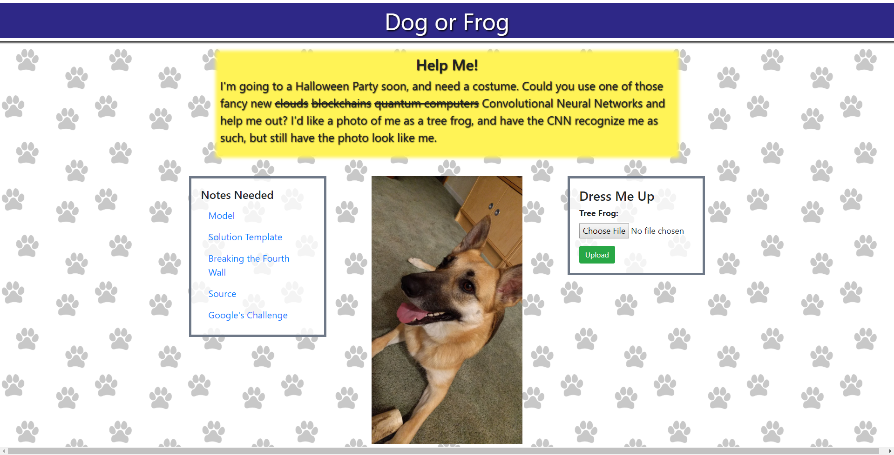
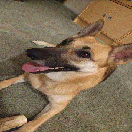

+++
title = "picoCTF 2018 - Dog or Frog"
date = 2018-10-14T03:51:44.809Z
updated = 2018-10-14T06:43:05.105Z
aliases = ["/posts/5bc2bd50da39a06603ce0d4b-picoctf-2018-dog-or-frog"]
[taxonomies]
tags = ['picoctf18', 'machine-learning', 'adversarial-learning']
categories = ["ctf-writeups"]
+++

# Problem
> Dressing up dogs are kinda the new thing, see if you can get this lovely girl ready for her costume party. 
>[Dog Or Frog](http://2018shell2.picoctf.com:5467/)

# Solution
When we visit the page, we are greeted with a submission form. The instructions tell us that this is a machine learning 
problem and to not approach it as a web-exploitation problem. The goal is to submit an image that is similar (on a 
byte-by-byte basis) that is similar to the dog, but is recognized as a tree frog.

<!-- more -->

This type of problem is known as adversarial machine learning. After stumbling around some papers, I found 
[this one](https://arxiv.org/abs/1610.00768), which provided a library suitable for adversarial learning: 
[Cleverhans](https://github.com/tensorflow/cleverhans).

## Full Script

[Jupyter Binder](https://mybinder.org/v2/gh/srikavin/ctf-writeups/master?filepath=picoctf2018%2Fdog-or-frog%2FMain.ipynb)

## Final Image

The final image (left) looks visually similar to the original (right), but has added noise. When submitted to the 
challenge site, we receive the flag: `picoCTF{n0w_th4t3_4_g00d_girl_647b3719}`.
