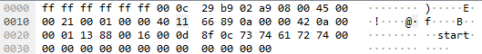
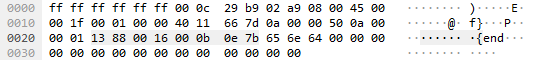

+++
title = "picoCTF 2019 - shark on wire 2"
date = 2019-10-09T20:23:07.387Z
updated = 2020-12-27
aliases = ["/posts/5d9e41ab6bac7409ac9e735e-picoctf-2019-shark-on-wire-2"]
[taxonomies]
tags = ['picoctf19', 'steganography', 'wireshark']
categories = ["ctf-writeups"]
+++

We are given a packet capture with little description of what to look for. While looking through the UDP streams, I came
across two packets with the text `start` and `end` within in the data section:

**Packet 1104:**



**Packet 1303:**



The only bytes changing between the start packet (#1104) and the next UDP packet (#1106) were the data field, checksums, 
and the source port. I noticed that the difference between the source ports of these two packets (5112 - 5000 = 112) was 
the ASCII code for the letter `p`. I repeated this for all the UDP packets (excluding MDNS queries) and found the 
following numbers:

<!-- more -->

```
112 97 97 97 97 97 105 99 111 67 84 70 123 112 49 76 76 102 51 97 97 97 97 97 114 51 100 97 97 95 97 100 97 97 116 97 95 118 49 97 95 115 116 97 97 97 51 103 97 97 97 97 48 125
```

This decoded into ASCII characters results in the following text:

```
paaaaaicoCTF{p1LLf3aaaaar3daa_adaata_v1a_staaa3gaaaa0}
```

And after removing extra `a` characters, we find the flag:

```
picoCTF{p1LLf3r3d_data_v1a_st3g0}
```
