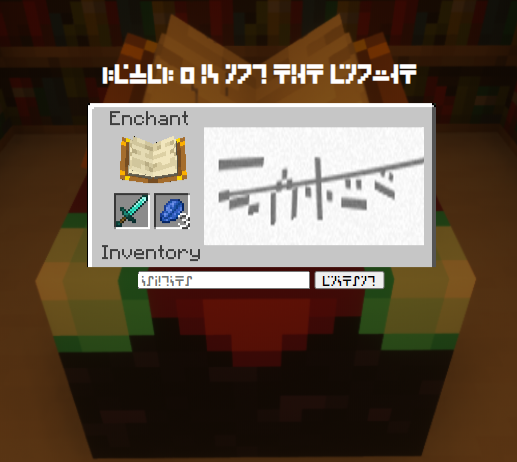

+++
title = "Solving Minecraft Captchas with Neural Networks"
date = 2020-07-25
updated = 2020-11-09
aliases = ["/posts/5f1c3dfcd7e47a02e27842ca-solving-minecraft-captchas-with-neural-networks"]
[taxonomies]
tags = ["uiuctf20", "machine-learning", "neural-networks"]
categories = ["ctf-writeups"]
+++

# Challenge 
> When on website: +1 spam resistance +10 user annoyance
>
>Gotta be fast! 500 in 10 minutes!
>
>https://captcha.chal.uiuc.tf

We're given a link to a website, which contains a picture of a Minecraft enchanting window. When we try to type into the
input field, our input is displayed in the [Standard Galactic Alphabet](https://minecraft.gamepedia.com/Enchanting_Table#Standard_Galactic_Alphabet). 
The challenge description tells us that we need to solve 500 of these captchas in 10 minutes. Even if I were fluent in 
this language, it would be difficult to solve 50 of these in a minute.



<!-- more -->

# Initial Steps

As with all web challenges, the first thing to do is to view the source code:

```html
<!doctype html>

<!--TODO: we don't need /captchas.zip anymore now that we dynamically create captchas. We should delete this file.-->

<html>
<title>UIUCTF</title>
...
```

## Dataset

Navigating to `/captchas.zip` gives us a nearly 1 GB archive of captcha images with the corresponding labels. The comment 
suggests that these captchas are dynamically generated and aren't in this dataset. 


But, because we have access to a massive data set, we can train a machine learning model (such as a neural network) to 
predict labels for these generated captchas.


## Network Architecture

Since the labels are part of the filename, we have to write a custom PyTorch Dataset class to load the images and their 
corresponding labels in a way that is usable by PyTorch. To avoid fine-tuning my own architecture in the middle of a CTF, 
I decided to use the built-in ResNet-18 model \[1].

### Why ResNet?

ResNet models have skip connections that smoothen the loss landscape, which allows for faster learning, and overall 
better performance \[2].


### Modifying the ResNet Architecture
Typically, when predicting a single label, the output is a [one-hot encoded vector](https://en.wikipedia.org/wiki/One-hot). 
But here, we have five labels that need to be predicted, so the output will be the concactenation of 5 one-hot encoded 
vectors. In this case, we have 26 characters in the alphabet, and we have to predict 5 labels, so the output dimension 
must be `5*26` (130).

The ResNet model was designed for the [ImageNet classification task](http://image-net.org/challenges/LSVRC/2016/index) 
(which has 1000 classes), so the final layer of the ResNet model has an output of size 1000. We need to replace this last 
layer for our task, so it only has 130 outputs.

```python
model = models.resnet18()
model.fc = nn.Linear(512, 5*26)
model = model.cuda()
```

# Data Preprocessing

Before we can use ResNet, we have to preprocess the input images. From the [PyTorch docs](https://pytorch.org/hub/pytorch_vision_resnet/):

>All pre-trained models expect input images normalized in the same way, i.e. mini-batches of 3-channel RGB images of shape 
>(3 x H x W), where H and W are expected to be at least 224. The images have to be loaded in to a range of `[0, 1]` and 
>then normalized using `mean = [0.485, 0.456, 0.406]` and `std = [0.229, 0.224, 0.225]`.

The normalization requirement only applies when finetuning a pretrained model. Since we're training the model from 
scratch, there's no need to follow their normalization scheme.

Here's my implementation of the `Dataset` class:

```python
class CaptchaDataset(Dataset):
    def __init__(self, root_dir):
        self.root_dir = root_dir
        self.dataset = [os.path.join(root_dir, i) for i in os.listdir(root_dir) if '.png' in i]
        self.mapping = {k:v for v,k in enumerate(string.ascii_uppercase)}
        self.inv_mapping = {k:v for k,v in enumerate(string.ascii_uppercase)}
        self.transform = Compose([Resize((224, 224)), ToTensor()])

    def __len__(self):
        return len(self.dataset)

    def __getitem__(self, idx):
        img_name = self.dataset[idx]
        label = os.path.basename(img_name).split('_')[0]
        
        image = Image.open(img_name)
        
        ret = []
        for char in label:
            row = [0]*26
            row[self.mapping[char]] = 1
            ret.append(row)
            
        image = self.transform(image)

        return (image.cuda(), torch.tensor(ret).cuda())
    
    def get_label_string(self, label):
        batch = []
        for i in range(label.shape[0]):
            cur = []
            
            for row in range(label.shape[1]):
                max_idx = label[i][row].argmax()
                cur.append(self.inv_mapping[max_idx.item()])
                
            batch.append(''.join(cur))
            
        return batch
``` 

## Gauging Model Performance

To get a feel for how my model was doing as it trained, I split the dataset into a train set (with 80% of the data) 
and a validation set (with 20% of the data). I used PyTorch's [`random_split`](https://pytorch.org/docs/stable/data.html#torch.utils.data.random_split):

```python
dataset = CaptchaDataset('captchas')

lengths = [int(len(dataset)*0.8), len(dataset) - int(len(dataset)*0.8)]
train_split, valid_split = random_split(dataset, lengths)
```

Then we need to define a data loader for each of the splits:

```python
batch_size = 64
train_dataloader = DataLoader(train_split, batch_size=batch_size, drop_last=True, shuffle=True)
valid_dataloader = DataLoader(valid_split, batch_size=batch_size)
```

# Training the Model

We need to define a suitable loss function because we have to classify multiple labels. Since we're outputting a 5x26 
vector, we can treat it as 5 separate one-hot encoded vectors and compute the 
[cross-entropy loss](https://en.wikipedia.org/wiki/Cross_entropy#Cross-entropy_loss_function_and_logistic_regression) 
for each one. So the custom loss function looks like this:

```python
def compute_loss(prediction, label):
    prediction = prediction.view(-1, 5, 26)
    loss = 0
    for i in range(5):
        loss += F.cross_entropy(prediction[:,i], label[:, i].argmax(1)).mean()
    return loss
```

We also need to define an optimizer to train our model. For simplicity, I'm using the 
[Adam optimizer](https://pytorch.org/docs/stable/optim.html#torch.optim.Adam) with the default momentum values and a 
small learning rate:
```python
optimizer = optim.Adam(model.parameters(), lr=0.0005)
```

Now we can train the model.

```python
metrics = {'train': [],'valid': [],'loss': []}

for epoch in range(1):
    epoch_metrics = {'train': [],'valid': [],'loss': []}

    model.train()
    for idx, (image, label) in enumerate(train_dataloader):
        optimizer.zero_grad()
        prediction = model(image).view(-1, 5, 26)
        loss = compute_loss(prediction, label)
        loss.backward()
        optimizer.step()

        # use numpy to speed up comparisons
        predicted_labels = np.array(dataset.get_label_string(prediction))
        actual_labels = np.array(dataset.get_label_string(label))
        accuracy = (predicted_labels == actual_labels).sum() / prediction.shape[0]
        epoch_metrics['train'].append(accuracy)
        epoch_metrics['loss'].append(loss.item())

        print(f"Epoch {epoch+1} Batch {idx+1} Loss {loss.item():.2f} Accuracy {accuracy:.2f} ", end='\r')

    model.eval()
    for idx, (image, label) in enumerate(valid_dataloader):
        prediction = model(image).view(-1, 5, 26)
        predicted_labels = np.array(dataset.get_label_string(prediction))
        actual_labels = np.array(dataset.get_label_string(label))
        accuracy = (predicted_labels == actual_labels).sum() / prediction.shape[0]
        epoch_metrics['valid'].append(accuracy)

    metrics['train'].extend(epoch_metrics['train'])
    metrics['valid'].extend(epoch_metrics['valid'])
    metrics['loss'].extend(epoch_metrics['loss'])
    print(f"Epoch {epoch+1} complete.")
    print(f"Training Loss: {np.mean(epoch_metrics['loss'][-1]):.2f}")
    print(f"Training Accuracy: {np.mean(epoch_metrics['train'][-1]):.2f}")
    print(f"Validation Accuracy: {np.mean(epoch_metrics['valid'][-1]):.2f}")

# save the model to disk
torch.save(model, "model")

# save the metrics
json.dump(metrics, open('metrics.json', 'w'))
```

## Model Performance

{{ svg(path="5f1c3dd5d7e47a02e27842c7.svg") }}

# Interfacing with the Website

Now that we have a working model, we just need to connect it to the challenge site. I used BeautifulSoup and requests to 
parse the HTML to get the image and send the solved captcha:

```python
import base64
import string
from io import BytesIO

import requests
import torch
from PIL import Image
from bs4 import BeautifulSoup
from torchvision.transforms import ToTensor, Resize, Compose

mapping = {k: v for v, k in enumerate(string.ascii_uppercase)}
inv_mapping = {k: v for k, v in enumerate(string.ascii_uppercase)}


def get_label_string(label):
    batch = []
    for i in range(label.shape[0]):
        cur = []

        for row in range(label.shape[1]):
            max_idx = label[i][row].argmax()
            cur.append(inv_mapping[max_idx.item()])

        batch.append(''.join(cur))

    return batch


transform = Compose([Resize((224, 224)), ToTensor()])

# load the model
model = torch.load('model').eval()

def get_prediction(image):
    image = transform(Image.open(image)).cuda().view(1, 3, 224, 224)
    model_output = model(image).view(-1, 5, 26)
    return get_label_string(model_output)


s = requests.Session()

while True:
    resp = s.get('https://captcha.chal.uiuc.tf/')

    soup = BeautifulSoup(resp.content, 'html.parser')

    captcha_src = soup.find_all("img")[1]['src'][len('data:image/png;base64,'):]

    im = BytesIO()
    im.write(base64.b64decode(captcha_src))

    prediction = get_prediction(im)
    s.post('https://captcha.chal.uiuc.tf/', data={'captcha': prediction})

    print(soup.find_all("h2")[0], prediction, s.cookies)

```

We can run this script, and after 3-4 minutes, we get the flag:


# Complete Source Code and Trained Models

Available [here](https://github.com/srikavin/ctf-writeups/tree/master/uiuctf2020/Bot%20Protection%20IV).


# References

1. [He, Kaiming, et al. "Deep residual learning for image recognition." Proceedings of the IEEE conference on computer vision and pattern recognition. 2016.](https://arxiv.org/abs/1512.03385)

2. [Li, Hao, et al. "Visualizing the loss landscape of neural nets." Advances in Neural Information Processing Systems. 2018.](https://arxiv.org/abs/1712.09913)
