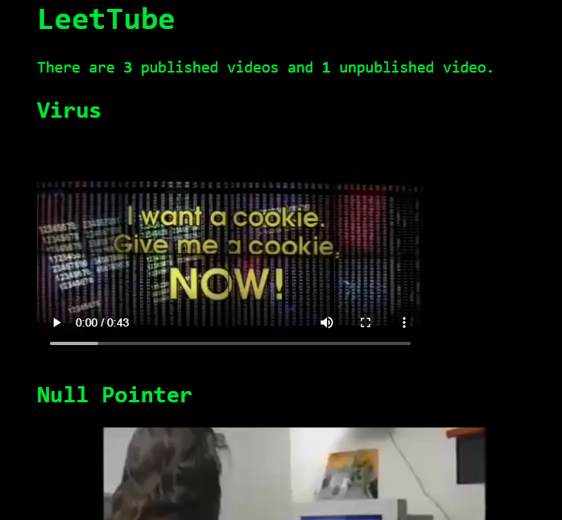

+++
title = "ångstromCTF - LeetTube"
date = 2020-03-18T23:36:12.437Z
updated = 2020-03-29T02:10:25.394Z
aliases = ["/posts/5e72b06cd6d41508cf61f796-angstromctf-leettube"]
[taxonomies]
tags = ['angstromctf2020', 'web', 'local-file-inclusion']
categories = ["ctf-writeups"]
+++

# Challenge
> I developed a new video streaming service just for hackers. Learn all about viruses, IP addresses, and more on 
> [LeetTube](https://leettube.2020.chall.actf.co/)! Here's the [source code](https://files.actf.co/5fb7188c18fde9206e4a43f5c817b4a9db6ee784366b65033904a2538d0d1782/leettube.py) 
>and the [Dockerfile](https://files.actf.co/929adf47a8fe915cc89618c9f4ec38068cc08525087171832cdd3c9c3f6db897/Dockerfile).
>
> Note: the server is also running behind NGINX.



The application is simple enough--It serves videos and has both public and unlisted videos. 
The Dockerfile uses `FROM kmh11/python3.1`, which is weird because [Python 3.1](https://www.python.org/download/releases/3.1/) 
was released nearly 11 years ago.  To ensure the name wasn't misleading, I ended up verifying the Python binary in the 
docker image, but I didn't find any related vulnerabilities. However, there is a noticeable vulnerability in how paths 
are handled.

<!-- more -->

```python
#!/usr/bin/env python
from http.server import HTTPServer, BaseHTTPRequestHandler
import urllib.parse
import os

videos = []
for file in os.listdir('videos'):
	os.chmod('videos/'+file, 0o600)
	videos.append({'title': file.split('.')[0], 'path': 'videos/'+file, 'content': open('videos/'+file, 'rb').read()})
published = []
for video in videos:
	if video['title'].startswith('UNPUBLISHED'): os.chmod(video['path'], 0) # make sure you can't just guess the filename
	else: published.append(video)

class RequestHandler(BaseHTTPRequestHandler):
	def do_GET(self):
		try:
			self.path = urllib.parse.unquote(self.path)
			if self.path.startswith('/videos/'):
				file = os.path.abspath('.'+self.path)
				try: video = open(file, 'rb', 0)
				except OSError:
					self.send_response(404)
					self.end_headers()
					return
				reqrange = self.headers.get('Range', 'bytes 0-')
				ranges = list(int(i) for i in reqrange[6:].split('-') if i)
				if len(ranges) == 1: ranges.append(ranges[0]+65536)
				try:
					video.seek(ranges[0])
					content = video.read(ranges[1]-ranges[0]+1)
				except:
					self.send_response(404)
					self.end_headers()
					return
				self.send_response(206)
				self.send_header('Accept-Ranges', 'bytes')
				self.send_header('Content-Type', 'video/mp4')
				self.send_header('Content-Range', 'bytes '+str(ranges[0])+'-'+
					str(ranges[0]+len(content)-1)+'/'+str(os.path.getsize(file)))
				self.end_headers()
				self.wfile.write(content)
			elif self.path == '/':
				self.send_response(200)
				self.send_header('Content-Type', 'text/html')
				self.end_headers()
				self.wfile.write(("""
<style>
body {
	background-color: black;
	color: #00e33d;
	font-family: monospace;
	max-width: 30em;
	font-size: 1.5em;
	margin: 2em auto;
}
</style>
<h1>LeetTube</h1>
<p>There are <strong>"""+str(len(published))+"</strong> published video"+('s' if len(published) > 1 else '')+" and 
<strong>"+str(len(videos)-len(published))+"</strong> unpublished video"+('s' if len(videos)-len(published) > 1 else 
'')+".</p>"+''.join("<h2>"+video["title"]+"</h2><video controls src=\""+video["path"]+"\"></video>" for video in published))
.encode('utf-8'))
			else:
				self.send_response(404)
				self.end_headers()
		except:
			self.send_response(500)
			self.end_headers()

httpd = HTTPServer(('', 8000), RequestHandler)
httpd.serve_forever()
```

## Local File Inclusion?
It adds the user-supplied path to the base path:
```python
self.path = urllib.parse.unquote(self.path)
if self.path.startswith('/videos/'):
	file = os.path.abspath('.'+self.path)
```
This means if we send `/videos/../../../etc/passwd`, we should receive the passwd file.

### Bypassing Nginx WAF

Unfortunately, Nginx blocks the request:


My team was stuck at this point for nearly an entire day. After reading the 
[documentation](https://docs.python.org/3/library/http.server.html) for `BaseHTTPRequestHandler`, I realized that it 
didn't have a `query` variable. This meant that `self.path` included the query parameters. However, this application did 
not process the query string. 

This means we can do the following: `https://leettube.2020.chall.actf.co/videos/../?/../../`. Nginx will treat the last 
two `../`s as part of the query parameter, while LeetTube will happily include it into the path and resolve the path 
to `./../`.

## LeetTube? More like LeakTube

We don't know the name of the flag, and even if we did, we can't read it directly due to the `chmod` at the beginning of 
the script. An interesting target is `/proc/self/`. We initially tried to read files from `/proc/self/fd`, but we didn't 
receive any output. 

The psuedofile `/proc/self/mem` contains the memory of the calling program. Luckily, we can seek into the file at an 
arbitrary location using the `Range` header. By reading `/proc/self/maps`, we can find the address of the Python heap:


In the Python heap, only UTF-8 strings containing the name of the loaded files were present. From here, we decided to 
dump other areas of the Python process's memory. We found the contents of the video files in an anonymous memory page:

```
curl --path-as-is 'https://leettube.2020.chall.actf.co/videos/../?/../../proc/self/mem' -H "Range: bytes $(python3 -c 'print(f"{0x7f4d4c225000}-{0x7f4d4cae6000}")')" --output memory.dump
```

## Finding the Flag

We're looking for the `.mp4` file containing the flag. The MP4 header is ` 66 74 79 70` at offset `4`. From this we can 
search for these characters and extract the file. We get a video with the flag:


